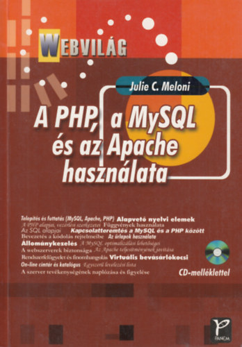

One day I felt the need to look up an old book that I used for learning my first programming language.

<!--more-->

I started my search on [bookline.hu](https://bookline.hu/) which is a Hungarian online book shop where you can buy from multiple
antiquarian book stores in a single order. Peak consumerism, but still... It's nice.

One thing led to another, and I ended up buying 5 books which I will talk about in this post. I want to clarify that these books are old, and I bought them for the sake of nostalgia, not for the content. They are in Hungarian, and the translation of the technical terms can be funky as hell.

## Pascal

I started to learn programming in the 2000s. I learned C# and Java, but my first language was Pascal. I used it for 2 years in computer science faculty once every two weeks. I recall building a graphical calculator with it, it took me about two months because, at the time, I only programmed in the school. Playing punk music had a much higher priority than experiencing the wonderful world of Pascal.

### György Pongor: Standardized Pascal: Programming and algorithms - 1993

If you paid attention, you might notice that I learned from a decade-old book. This was not a conscious choice, as keeping up-to-date was not a priority in my public school education. Nonetheless, I am grateful for any opportunity to learn about programming.

The book itself has a quite annoying aspect, which is a problem with most of the books I bought. The translation of terms makes it harder to understand the presented concepts, and in the code examples, there are a lot of Hungarian variable and method names.

> Fun fact: *the Hungarian translation of Robert C. Martin's Clean Code had an online dictionary because a lot of people could not understand the translated terms. I deeply empathize.*

Despite its limitations, the book has several redeeming features. It contains algorithms with code examples, sequence diagrams, and other forms of visualization, and the explanations are really comprehensive.

As an example, **recursion** is explained with the [Tower of Hanoi](https://www.geeksforgeeks.org/c-program-for-tower-of-hanoi/) algorithm. Which is needlessly complicated example, so it should be in a book.

### Erzsébet Angster: The basics of object-oriented design and programming - 1997

I could have bought any book by Erzsébet Angster because they were very common residents of school libraries. I chose this one for its topic. You can find everything in it, from real-life examples of objects (like a butcher's shop) to deep class inheritance hierarchy.

This book could start a civil war in the current developer landscape, it's a product of its time. And it has diagrams!

## Web development

### Julie C. Meloni: PHP, MySQL and Apache - 2004

The Hungarian translations of "Teach Yourself..." books were very popular in the 2000s. I'm really confused by the editions because there are two
authors, [Julie C. Meloni](https://www.amazon.com/stores/Julie-C.-Meloni/author/B001IOF7KU?ref=ap_rdr&store_ref=ap_rdr&isDramIntegrated=true&shoppingPortalEnabled=true)
and [Matt Zandstra](https://www.amazon.com/stores/Matt-Zandstra/author/B001ITYM3S?ref=ap_rdr&store_ref=ap_rdr&isDramIntegrated=true&shoppingPortalEnabled=true)
who wrote php related books in the so-called "Sams Teach Yourself *SUBJECT* in 24 hours" series.

This book promises a lot of things and surprisingly it sort of delivers.

It goes through setting up a web server with Apache, installing MySQL and PHP on Linux and Windows (wild!). It covers
the basics of PHP and MySQL in great detail. It has some example projects such as an online mailing list and a simple
webshop, and it contains every code and every step that you need to do to get it up and running.

This is certainly not the way that you would want to approach any development nowadays. The codebase is composed of PHP files which include HTML and PHP blocks in a sequential manner representing one page. A long time ago, I did maintain
sites with this structure, and it does not scale... I mean at all. On the other hand the database schemas are well
normalized and the configuration of Apache is nicely explained.

This is not how you develop a project, but it makes you understand the important parts of the stack.

## Bonus

### András Büki: UNIX/Linux shell programming - 2002

This is the bonus book. I did not read it when it came out. I bought it because the title of this book is a one-to-one translation of "Shell programming," and I found it hilarious.

All that said, I really like this. It's a good introduction to shell scripting. It has code examples, a lot of commands with explanations, a lot of tasks to solve with solutions, and bad terminology translations (for example, *pipeline* is more like *"pipe network"* in the translation).

I love it!

### Microsoft MS-DOS Version 5.0 Manual - 1991

This must seem quite random, but I bought this because this was the first command line I used.

My first computer was an Amiga 500, and my parents and I thought that it was simply for playing games. You see, if you put a floppy disk with a game in it into the floppy drive, the computer will start the game without questions.

So with ignorance and some good intentions, my parents asked me if I would want a proper computer. I said yes, and they changed my Amiga 500 to a PC with an 80386 processor.

And there I met mr. MS-DOS.

## Conclusion

I'm not going to say that I recommend these books, but I do recommend to show some appreciation for your old books and
see how far you come, having some fun along the way.
