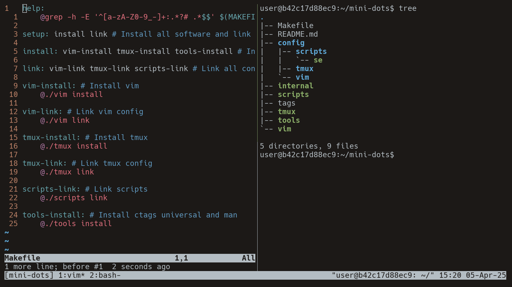

Last time, we set up **vim** with no plugins, featuring fabulous capabilities like file navigation, search, and code navigation. This time, we will take care of **screen management** and **automation**. So grab your neckbeard and enjoy the ride.

<!--more-->

## Screen Management

This will be the simplest part. I use **tmux** for screen management. But to be fair, it's more like session/screen/project management. Sessions will be persistent while the **tmux** server is running, and you can create multiple **windows** and **panes** with it. I usually open a **tmux** session per project folder, so that is handled by it as well.

The configuration changes are not the most exciting ones. Like **vim** has a leader key, **tmux** has a prefix key. I set it to `Ctrl + a` because it has some **GNU Screen** vibes and is much more comfortable than the default: `Ctrl + b`. _(**B** should be pressed by the left hand, and my Ctrl is in an unconventional place, so that is not great.)_

I change **window** and **pane** indexes to start from one; it just makes much more sense to me. By the way, I think there is no way to set the session index to start from one, and that makes me quite sad. Send help.

Also, I set up some bindings for more vi-like navigation, moving between panes with _hjkl_ and switching mode keys to vi-like as well.

Additionally, I increase the status bar length and set the refresh rate to 1 second because we're using those resources, baby!

```shell
set -g prefix C-a
set -g base-index 1
set -g pane-base-index 1
set -g mode-keys vi

# Pane navigation with prefix + hjkl
bind h select-pane -L
bind j select-pane -D
bind k select-pane -U
bind l select-pane -R

# Colors
set -g default-terminal "${TERM}"
set -ag terminal-overrides ",${TERM}:RGB"
set -g status-bg white
set -g status-fg black

# Status line
set -g status-left-length 50
set -g status-interval 1
```

This is all I need to be comfortable with **tmux**. Leaving plugins in this case wasn't hard because I hadn't used any for a while already. And of course, it looks beautiful, _♪ no matter what they say ♪_.



There is one more component for **tmux** and for the whole setup. I created a custom script to easily create sessions by the current folder. When the script is called, a tmux session will be created with the current folder's name, or if it exists, it will be attached.

```shell
#!/bin/sh

session() {
  session_name="$(basename "$(pwd)")"
  tmux new -s "$session_name" 2>/dev/null || tmux attach -f "$session_name"
}

session
```

## Automation

Now we have a **text editor** and a **screen manager**. But how should the installation and the automatic configuration be handled? I have a very opinionated solution for this, and I like it so much that I would even recommend it.

But let's lay down what needs to be solved. We need to install programs and distribute their configuration, which in itself is quite simple. In the first part, I mentioned I handle my development environment setup with **Ansible**. Since I don't want to install my whole setup with plugins, I obviously don't want to install **Ansible** with all of its dependencies.

But there is two things that I really like and want to keep:

- Separating tasks by tags, so they can be organized and run separately.
- Stop at the first failure, so I can fix it and run the setup again.

Keeping all this in mind, the automation will be handled by **POSIX** shell scripts, and they will be driven by a **Makefile**. Shell scripts will provide the possibility of portability, and with **Makefiles**, I can retain the functionalities of **Ansible** that I just mentioned.

### Structuring shell scripts

At the beginning, I was really overthinking this, so I concluded that all shell scripts should be in the root folder of this setup project. It just makes handling paths so much easier, and the entry point will be a **make** command anyway.

But there are some rules I set for myself:

- All scripts implement the same functions, namely: **install** and **link**, because they will install the program and symlink the configuration file to the right place.
- All scripts have a function as an entry point, so there is full control over the arguments they can receive. _(I think this is generally a good practice.)_
- All common functionalities can be placed in a script called `internal`, and it is sourced by all other scripts. This includes defining the base directory and functions that are needed in multiple places.

But let's talk about that **internal** script more, by looking at another script, the **vim** one.

```shell
#!/bin/sh

. ./internal

install() {
  prints "Installing vim..."
  is_debian && sudo apt install -y vim
}

link() {
  prints "Linking vim config..."
  ln -sf "$DIR"/config/vim/.vimrc "$HOME"/.vimrc
}

main "$1"
```

There are some printing methods that come from the `internal` script, and they are used to print messages. The `is_debian` function checks if the system is a **Debian** based one, and if so, it installs **vim** with `apt`. _(Maybe it should be called `is_apt`, sue me.)_

And your eyes are not deceiving you; there is a call for the `main` function, but you don't see the definition. That is because it's defined in the `internal` script. For a clear picture, `main` looks like this and will be the entry point of all scripts, so they can be called like: `./vim install`

```shell
main() {
  case "$1" in
    install)
      install
      ;;
    link)
      link
      ;;
    *)
      echo "Usage: $1 {install|link}"
      exit 1
      ;;
  esac
}
```

So that is some _poor man's inheritance and interfacing_ without really having it. But I really like the structure.

### Organizing scripts into tasks

Here is a simplified version of the **Makefile**:

```makefile
setup: install link

install: vim-install tmux-install

link: vim-link tmux-link

vim-install:
    @./vim install

vim-link:
    @./vim link

tmux-install:
    @./tmux install

tmux-link:
    @./tmux link
```

At the bottom, there are the script calls with install and link arguments, organized one by one in different **targets**. This makes calling them from other targets very easy. There are three collector targets: one for every install, one for every link, and one for **EVERYTHING**! _(And this is something I use in reality; there are systems where I don't want to install, just use my configurations.)_

### What I don't do

For now, this kind of setup does not have any interactive shell **rc** file. The reason for this is I want to keep the default shell that comes with the systems with the default settings. The only thing I certainly change is enabling vi mode _(like everywhere)_, but for now, I do it by hand.

## The End

Thank you for taking this two-part journey with me. I hope you laughed, cried, and changed your life. As usual, you can check out the [repository](https://github.com/hrvthzslt/mini-dots). Keep up the _computering_!
