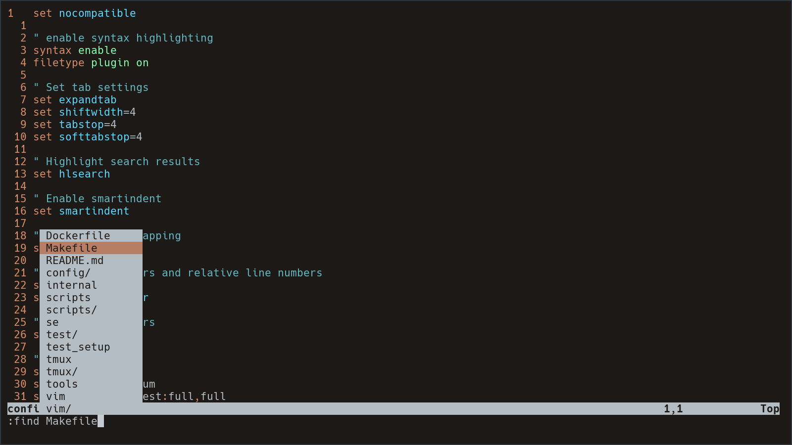
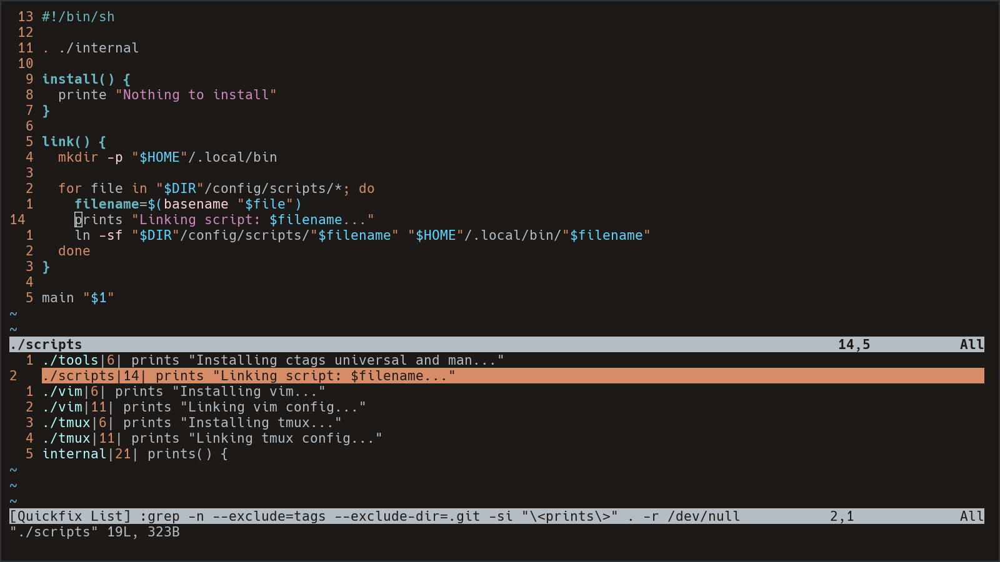

Most of us have one or more automation to set up our machine and/or development environment. This solutions grow over time and with it the time to set up a new machine. But no more! Time has come to create a leaner solution because I don't want to wait 20 minutes. Period.

<!--more-->

## Origin Story

I have two huge projects that are responsible for automating my machine setup. One deals with the desktop environment and the other is my "dotfiles" which sets up everything I need for my professional and hobby development endeavors.

That contains setting up programming languages, like **PHP** (the best), **Python**, **Go**, **NodeJs** for javascript, and tools like **Docker**. And next to this it installs the **CLI** programs that I love to use like **Neovim** (which has it's own automated plugin setup), **Lazygit**, **Lazydocker**, **Lazyman** (one of this is made up) with the **nix** package manager. Speaking of **nix** of course the installation of it is automated as well, _and no I don't use nix home manager and I won't, leave me alone mother!_ And the top of the iceberg is that this whole setup in orchestrated with **Ansible**.

This sounds like a work of a mad man, which is. **But** it's very comfortable to maintain, and run.

I use this setup on my personal computer and the config files on my work computer. But when I want to interact with my home server or virtual machines, I don't need this much.

So I broke down the bare minimums I would need: **vim** for text editing, **tmux** for session management and automation with **shell** scripts (no **bash** mind you), which will be organized in a **Makefile**. And most importantly **NO PLUGINS**!

If you work with a lot of remote machines I imagine you shrug your shoulder and roll with the defaults, I respect you, but I'm a web developer, so joke on me.

## Text Editing

So why I don't want to use plugins? Let's inspect an example: For getting language support in **Neovim**, I would install the language toolchain, a **Language Server** and possibly some plugins for easier management. That's a lot of _stuff_, per language.

_I need to note that you **can** set up **Neovim** with a very minimalistic config, please read this [post](https://bread-man88.github.io/blog/programming/2025/03/14/simple-nvim-config.html), it's great._

For this setup I chose to use **vim** without plugins, for keeping dependencies minimal. Here I'll try to explain what I found important, and how I solved it, without explaining the whole `.vimrc`.

### File navigation

For navigation there is a built in file explorer called **Netrw**. And I set up shortcuts for four global marks to be created and used, that adds a "bookmark" functionality for easier navigation.

### File search

For this I set up search to work from the working directory, and search in sub folders. With this setting when `:find` command is used, it's a very similar experience to using a fuzzy finder tool. I also enable **wildmenu** and set it so appear as a vertical menu for scrolling trough results. Vertical menu called **pum** which has horrible base colors so I change them, but I don't change anything else regarding the colorscheme.

```vim
" Search subfolders
set path=$PWD/**

" Set wildmode
set wildmenu
set wildoptions=pum
set wildmode=longest:full,full
```

Looks like this in action:



### Code navigation

Without the help of **LSP** navigation can be done with the built in `tags` functionality, and searching. For tagging I user **universal ctags** from it's name you can assume it's origins and that it's expanded to multiple languages. That tool creates an index file with the following command:

```bash
ctags -R .
```

You can add multiple paths, which can be needed but I usually use it in the scope of the project.

There is a **go to definition** functionality in vim already, but it works in a file by default. I created a method that jumps to a tag if there is one or the original behavior applies.

```vim
function! GoToTagOrDefinition()
    try
        execute 'tag ' . expand('<cword>')
    catch
        execute 'normal! gd'
    endtry
endfunction
nnoremap gd :call GoToTagOrDefinition()<CR>
```

The other side of this coin, is **go to reference**. This is done by searching the word under the cursor, and showing all results in a quick fix list.

```vim
nnoremap gr :grep! --exclude=tags --exclude-dir=.git -si "\<<cword>\>" . -r<CR>:copen<CR>
```

And the quickfix list looks fabulous:



These are the most important features in my opinion, but I have to mention two things:

- This can scale poorly in large code bases, since text based search will result in a lot of false positives.
- The knowledge to do this comes from this great video: [How to Do 90% of What Plugins Do (With Just Vim)](https://www.youtube.com/watch?v=XA2WjJbmmoM)

## Session Management

## Automation
