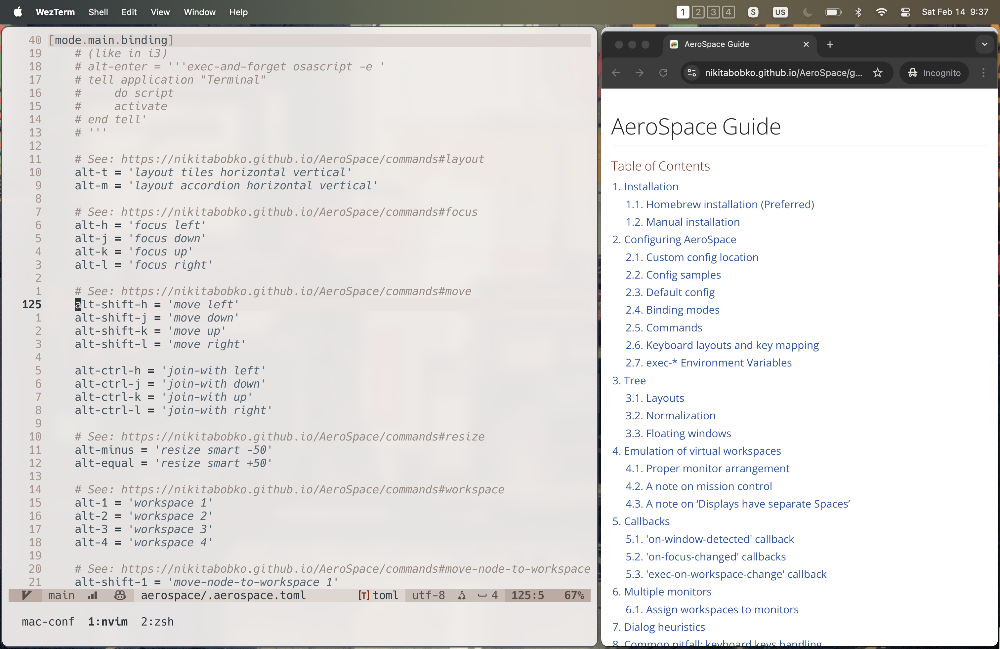

+++
date = '2026-03-01T13:07:38Z'
draft = false
title = 'Calling a Truce With MacOS'
+++

Once I used MacOS as a common folk, but it had an Intel chip. Later I wanted to use it as a Linux cosplay, but it was restricted. After two unpleasant experiences, the third time brought salvation this operating system needed in my eyes.

<!--more-->

We need to clear up two things. First, this post wont be a **MacOS** shaming campaign (at least not intentionally). Second, there is no way in hell that I would buy a computer at this price range (although changing hardware prices may result in a different opinion in the future).

## Personal History

I don't really have a real personal history with **Apple computers**, unlike the **Amiga** or **x86 PCs**, I only used the first MacBook when those machines were long forgotten and I was much older. This is a very complicated way to express that I had a MacBook from companies I worked for, you're welcome.

The first one was a MacBook Pro, one of the last ones with an Inter chip. That is a great laptop if you like the sound profile of a helicopter in your room. (To be fair, this issue persist with current laptops as well, I'm looking at you Dell Latitude, If the Earth were flat, I would place you in a latitude where you would fell to Hell.)

I used it as any machine at the time: **IntelliJ** on full throttle, **Docker** on full cilinders, and a lost of Chrome tabs. It was loud, it was hot, but not attractive. At this point my own computers rolled Windows like there is no tomorrow, and there is none with that OS.

Then after some time, I've changed, some of my cells in my body were replaced, just as the primary operating system I used. I switched to **Linux**, because the only thing I liked about **Windows** was **WSL** (I mean in the end, I used to like Windows plenty some many years ago). I became a man of taste and needs, so when I've got a new MacBook, the realization that you cannot fully turn off animations were devastating. And this is the central problem, I think **MacOS** has a horrible desktop environment. To fix this issue me and my dear friend and colleague, created a ticket to require a laptop with Ubuntu, and we got it. Now that is what we call a life hack. (We got Dell Latitudes, so joke on us)

## Salvation

But then, the third time came. I got a new work, with a new MacBook and new problems to solve. You could say these are self-inflicted wounds, which is fair, but the same time, I (as everybody) needed to figure out how to use this machine productively.

Let's start with the great news. MacOS is a certified Unix operating system and my workflow is mostly terminal-based. This is a great match, even with the feeling that Apple try to hide its Unix roots, from the customers.

I made a decision to change the least I can on the system, and this is relevant with CLI tools as well. I kept **zsh** just because that is the default, my config is really similar to how I use **bash**. But after a little time I did kick in my decision, I installed **GNU coreutils**, because I had compatibility issues with my scripts and configs. I choose **Homebrew** as a package manager, because it can install graphical applications as well, and that is very handy for automation.

I still had to solve the problem of window management and navigation. I did not go to a _try every option_ world tour, I did my homework, found that **AeroSpace** will be the best fit for me. It handles window and workspace management and keybinding in one place in non-intrusive manner, with one configuration file. It is very similar for **i3**, which is not the best (**dwm** has my hearth), but really good. For workspace management it has its own implementation, it places windows out of focus if they are not in the current workspace. This has a really interesting side effect, at a least some pixels of the window has to be in screen, so those pixels are visible in the corner. Still it's too easy to use to get hung upon this issue.

For software keyboard remapping, I use **Karabiner-Elements**. It's a great tool, but I don't really like it because it's more complicated to operate, one config file won't do the trick. I chose it because it was easy to port my existing **keyd** keymap, and I really did not understand **Kanata** at the time. (I'll be back)

My physical keyboard with **QMK** should have worked, if I did not remove the Mac layer in my custom layout. Now that **was** a self-inflicted wound! Don't worry, I fixed it, and I'm regenerating.

## Making Peace

Don't get me wrong, nothing beats the flexibility of a **Linux** distro. But I reached the point where I can say when a company gives me a very powerful machine, with a very impressive battery life, and a very good screen, I don't want to throw it to the Danube. The holy trinity of **CLI tooling**, **window management**, and **keyboard remapping** can save even a horrendously expensive computer.

And of course, the details of the workflow can be found in the [repository](https://github.com/hrvthzslt/mac-conf). Happy _computering™_!
