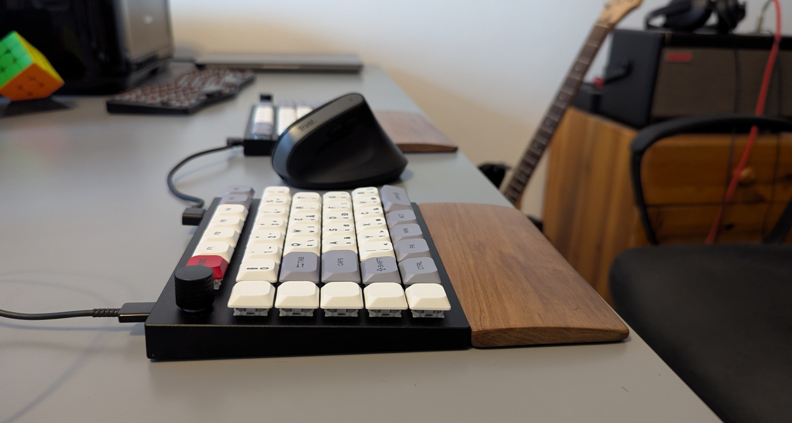
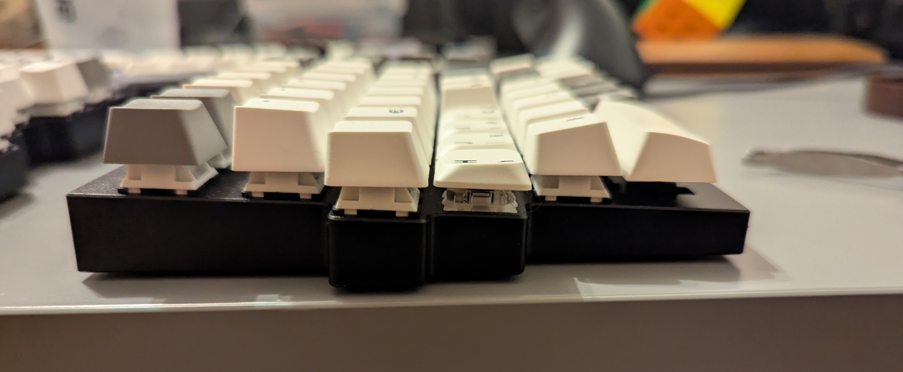
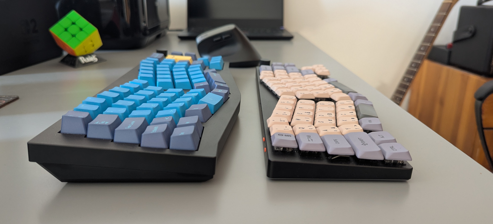

+++
date = '2025-10-18T17:49:43Z'
draft = false
title = 'From Here to K11'
+++

This is chronicle of finding the chillest keyboard after a lot of adventure. I tried out a lot of things and ended up loving simplicity (well relatively) the most.

## The "Hobby"

So what is this "hobby"? It was keyboard building, nowadays it's like a _consumerist Lego party_, but disregarding my tone, it has merits. The best thing about it that the components of a keyboard are interchangeable, and it's mostly an easy affair. There keyboards where you have to solder, but most branded mechanical keyboards are not like that.

So the "hobby" is building and customizing mechanical keyboards, with components like the board, a case, switches and keycaps. And in most of the cases they are programmable as well, but [that story has been told](/posts/create-custom-keyboard-layout-with-qmk-for-no-reason)

## Q11

In the beginning I have to state: Most of the keyboard I tried are _Keychron_. This fact does not have any complicated explanation or brand love. They are very accessible in Hungary, and I'm satisfied with them.

I had a very cheap _epic gamer_ mechanical sixty percent keyboard, it had brown switches and a hollow sound profile, I quite liked it. I even employed some [software remapping](/posts/making-a-better-keyboard-layout) for a better typing experience.

Since I liked it I wanted to try out something that is more comfortable. I checked out some keyboard with an "Alice" layout (they will come up a lot). In the end I choose to try out a full split keyboard, so I got a **Q11**.

This keyboard used to look quite different, it came with **Gateron Brown Switches**, which I really liked, and some keycaps that I liked less. The first thing I changed were the keycaps, it got some double shot PBT keycaps, with light colors, because I like the contrast with the body.

I would not say that the switches were loud, but I wanted to try silent switches. I tried **KAILH Silent Brown** switches, which was not really silent, but otherwise decent, and later **Akko Penguin Silent** switches. This latter one is tactile like the brown. It's a common complaint that these switches feels "smushy", it's true, I loved it.

But in it's current state like it he picture it, it transformed into a low profile keyboard. The star of this post is another low profile keyboard coming up later, inspired me to try to transform the **Q11**.

## Transform MX Switches to Low Profile

This is a less trivial thing that it seems. There are multiple type of low profile switches and none of them are compatible with MX switches. The very simple reason is that they have pin positions elsewhere, so they would need a different board.

But there is a switch for solving this problem, the **OUTEMU GTMX Low Profile Switch**. It's more like mid-profile, but lower, so that is great.

_Left: **Gateron Brown**, Right: **OUTEMU GTMX Low Profile**_

Assembling it is quite a simple job, I just had to change the switches and keycaps. I made a picture during the procedure to show the difference:

The current swithces are somewhat louder than other brown switches, and the keyboard itself only has some factory applied tape mod, so it could sound better. I take this sacrifice for having the switches in the open outside of the body, because that is an asthetic I really like. I did not found silent alternative, maybe one day.

If some one wants a split keyboard with a staggered layout, from me this is a hard recommend.

## Cidoo ABM066

Alice keyboards still bugged my mind, so I went for a used budget option that I found by accident (If checking used hardware site like a rabbid animal qualifies as accident). It was a barebones set, meaning no switches and keycaps, but I think you figured out that I have enough at home already.

This was a very pleasant introduction to Wonderland (you know Alice, haha, joke), and I maybe, perhaps, possibly would recommend it with one caveat.

This keyboard is advertised as **VIA** compatible (a keyboard layout customization software), which is true, but the firmware that is shipped with this keyboard, does not supports all the functionalities that **VIA** provides.

It's a shame because the white variant that I got, has a really good old-school hardware feeling and it is very comfortable.

I used it with the **Akko** silent switches, and sold it with the **KAILH** ones, they can go to hell, the were not silent, yes I'm still grumpy about that, even if they are decent switches.

## Q8

This keyboard is special because of two things: At the time they were around half the price in all Hungarian stores, they are older models, but still lucky. This was the first keyboard I layed my eyes on.

So the price was already covered by the late **ABM066**, I still had enough tools to populate a barebones keyboard, so what is the harm?

Well... This will be a disservice to this keyboard, but I don't really like it. (Mind you I would recommend this keyboard more that the **ABM066**, because most of the keyboards are as bulky as this one and most of the people seem to like it.)

The good thing is that this keyboard is very durable but the bad thing is that it's freakin' huge because of it. I do like the fact that it's almost two kilograms, so I can kill a bear with it if there's a situation. And the typing experience itself is good. But in the end it just not comfortable. I used with palm rests, I typed with floating hands (which is the way), but it never felt right and I feel this is related to how it's body is constructed not to the layout.

## K11

So this is the keyboard which made me want to write this heroic tale.

The reason why I know **Q8** had no problem with the layout is that I really like this keyboard, and has the same one. But check out this size difference:

**Q8** would eat two our three **K11** for snack. At the time I wanted to try this keyboard, I did not made "low-profile" mod on the **Q11**, so I did not know how would I like the low profile. The reason for trial is that I wanted more comfort, and the other keyboards seemed to tire my hands more than my laptop keyboard.

All the things I like are surpised me:

The **Gateron KS-33 Low Profile 2.0 Mechanical Switches** (wow that's a name...) are a bliss, and paired with the default keycaps they are much more comfortable than I expected. Key presses still have a nice travel, tactility still can be felt. This profile gives me every benefit of a mechanical keyboard typing experience just better.

It has USB 2.4GHz and Bluetooth connection, which I looked down because big boys deals with cabels. I can use this keyboard easily with my android phone to change the world in Termux, that's all I say...

And it turned out I really like that it's a unibody keyboard, **Q11** was quite a hassle to travel with, **Q8** was even bigger and heavier. This keyboard can be placed, replaced easily, and event fits on my laptop right now.

I did some side adventure with **Gateron Red Low Profile**, switches. For me it's a hard pass, it has similar operating force like the brown one. The problem is since it does not have a pressure point, for me it feels harder to press than a tactile switch. Maybe it's silly, but I'll listen to my hands.

One more thing before we get our tearful goodbyes! There is one word that did not come up yet: **Ergonomics!**. All of these keyboards can have enough ergonomics advantages, or those advantages can be questionable if they are not meeting your needs.

Having a split layout is a plus in itself, and it has a very nice side-effect. There are more keys for the thumbs. Especially in the Alice layout keyboards, there are two spaces, two keys in the middle, and technically the second B key can be used by a thumb as well. I don't do anything wildly unconventional with those keys, only some layering and tap-hold bindings, but they are the best thing about these keyboards. Also low profile can be viewed as an ergonomic feature, do with this statement what you like.

I certenly recommend this keyboard, it's feature rich and chill as hell.

I bid you farewell, spend less on keyboards.
