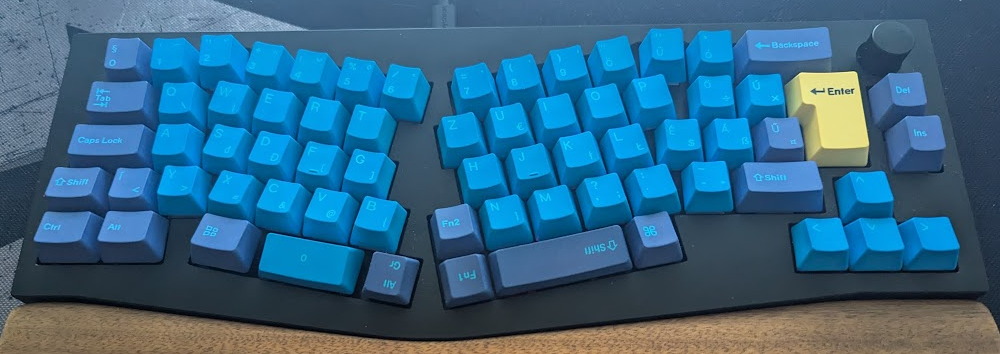

I was a really happy user of a Keychron Q11 when I decided I wanted to try the Q8 as well. I really like layouts in the "alice" family, but when I set my layout up with VIA, something felt wrong. This sent me down a path that started with flashing new firmware to the keyboard and ended with compiling it with my own layout.

<!--more-->

If you're a good observer, the title says there was no good reason to compile QMK, but I was talking about some problem. Don't be confused; this whole thing could have been handled without creating my own layout in QMK.

## Peaceful Times

Not so long ago, I wrote about my custom [layout](/posts/making-a-better-keyboard-layout) that was applied with software in the OS itself. I happen to have mechanical keyboards that can be programmed themselves. You saw flying big words here like **QMK** and **VIA**; let's clear them up.

- **QMK** is a keyboard firmware that controls key mapping, lighting, and other features of a keyboard.
- **VIA** is a software that allows you to configure your keyboard in a graphical interface without flashing it.

So I set up my layout in **VIA** for my Q11, and all was great. I use Caps Lock as Esc/Ctrl, so when I use a key combination with Ctrl, the handling of timing is really important. The press time and the release timeout have to be set up with values that will result in a nice typing experience, so when I roll over Ctrl and C, it will be detected. If this is not set up with the right values, Caps Lock has to be held firmly and for a long time to be used as Ctrl, which is _yuck_.

Now that experience in the Q11 (or even with software mapping with keyd) was great already.

## Complication!

But then, I got my Q8. It is a beautiful beast, almost two kilograms of aluminum, so if you drop it on your foot, it will certanly break it and you may need assistance for walking for the rest of your life. It has an **Alice** (_akshually_ it's more like an **Arisu**) layout, but the most important thing to me that it has multiple buttont for the thumbs, so I can map Enter, Alt and Backspace to this area.



I set up the layout in VIA, and it felt wrong. I knew that the Tap Hold functionality has an associated timeout value, referenced by the name **TAPPING_TERM** in QMK, and suspected that the Q8 firmware has a different value for it than the Q11. I was wrong, but I was on the right path.

So I checked out the firmware version in **Keychron Launcher** (another program, it's Keychron's take on VIA) and it was older than what can be downloaded. Woo-ho, let's flash a keyboard.

There is a designated software that would help me called **QMK Toolbox**. I use Linux, so that is not an option, joke on me. So I installed **qmk_firmware**, which provides the firmware (surprisingly) and a CLI tool. For my utmost pleasure, after some investigation, I found a package repository provided by the QMK team for Debian, so I installed it without much hassle.

With the downloaded firmware and CLI tool, I was able to flash the keyboard. The problem was solved, the typing feeling was great again.

## The "Fun" Part

But then I thought, why not compile QMK firmware with my own keymap? I already installed the tools for it. And as it turned out, QMK is prepared for this party!

QMK provides the possibility to create changes in **user space** and in a **keymap**. User space changes are applied for all custom keymaps, and keymap changes are applied for a specific keymap. I created a new layout for the Q8. GitHub username is usually used for own keymaps, which in practice means that there is a folder called default for the default keymap and another called hrvthzslt for my custom one with the following files:

- `keymap.c` - the keymap itself
- `rules.mk` - makefile rules for the keymap

Without going into details, the keymap is a 2D array of keycodes organized by layers, and the rules.mk file is a makefile that tells QMK how to compile the keymap. Furthermore, macros have to be programmed here as well. With experience in C (which I lack) and a lot of documentation reading, this can be done fairly easily.

Usually, these changes are tracked in a forked repository of the QMK firmware, but I did not want the whole package, so I created a repository only with the files that are related to my **user space** and **keymaps** and created symlinks to the QMK codebase. This may seem ugly, but when I need the whole development environment, I can just open the QMK project instead of my repository with only my custom files. Maybe a mistake, but it's clearer for me for now.

## QMK Tips

Advanced mappings can be defined for future references like:

```c
#define MT_CTES MT(MOD_LCTL,KC_ESC)
```

This is a Tap Hold for Ctrl and Esc, and now can be referenced as **MT_CTES** in the keymap matrix.

Macros can be set up with catching inputs with the `process_record_user` function.

```c
enum custom_keycodes {
    MA_SUP1 = SAFE_RANGE,
    MA_SUP2
}

bool press_super(uint16_t keycode, keyrecord_t *record) {
    if (record->event.pressed) {
        register_code(KC_LGUI);
        register_code(keycode);
    } else {
        unregister_code(keycode);
        unregister_code(KC_LGUI);
    }
    return true;
}

bool process_record_user(uint16_t keycode, keyrecord_t *record) {
    switch (keycode) {
        case MA_SUP1:
            press_super(KC_1, record);
            break;
        case MA_SUP2:
            press_super(KC_2, record);
            break;
    }
}
```

This is a macro that will press the Super key and 1 when the key is pressed and release them when the key is released. The `SAFE_RANGE` is a range of keycodes that can be used for custom keycodes, so **MA_SUP1** can be mapped on the keymap matrix.

For validating that what I've done is remotely correct I can compile the firmware with the following command:

```bash
qmk compile -kb keychron/q8/iso_encoder -km hrvthzslt
```

This will compile the firmware for the Q8 with the custom keymap. All good lets flash it:

```bash
qmk flash -kb keychron/q8/iso_encoder -km hrvthzslt
```

Everything turned out wonderful. I had a custom build of the firmware with my own keymap, and I was really proud of myself after the first tests.

## MORE Complication!

I was really proud until I started typing as usual. The problem that I fixed with upgrading the firmware version came back with the custom build. **OH NO!**

So after two days of documentation reading and trying out different values for the **TAPPING_TERM**, I found out that I need another setting. The culprit is called **HOLD_ON_OTHER_KEY_PRESS**. This means when I pressed a key with Tap Hold mapping, the modifier layer will be active until other keys are pressed, making key combos with Ctrl comfortable again.

I think this means that the firmware that I downloaded is not compiled directly from the QMK repository, **or** compiled with some options that I'm not familiar with.

I also lost the reset functionality of the Q11, reimplemented it with a macro, and added it to the Q8 as well. One hand takes, the other gives.

To be honest, this was one of the more frustrating side projects I've done, but still, I learned a lot and had at least some fun. You can check out the repository [here](https://github.com/hrvthzslt/qmk-layouts)
