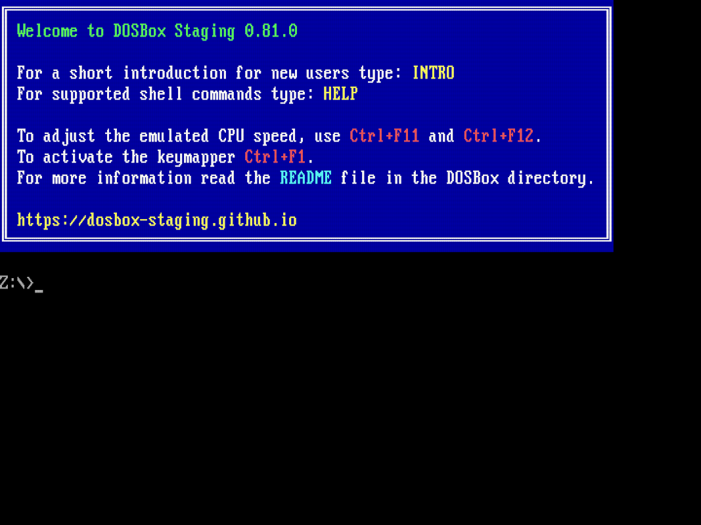
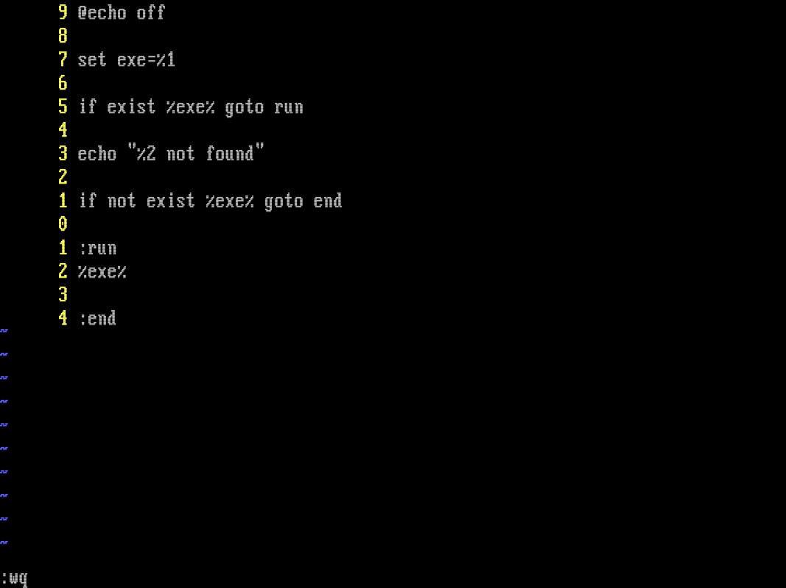
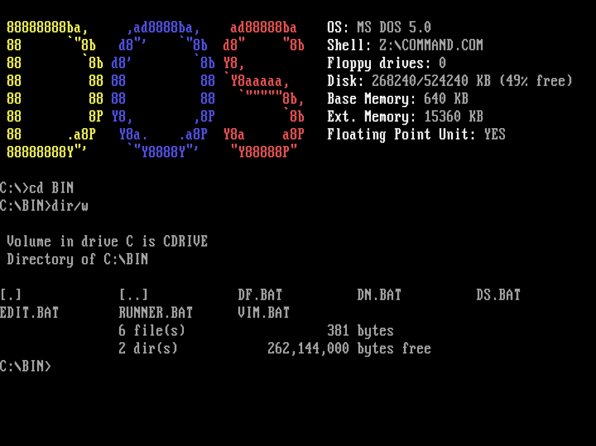

My first exposure to _computing_ was with an Amiga 500, closely followed by a 386 PC, which I used for a long time. Because of this, I have a soft spot for games like **Flashback** and **Lost Vikings** and for programs like **Norton Commander**.

Since all this can be used in **DOS**, and since that was the first operating system I learned to use, it's time to replicate that experience.

<!--more-->

## Cool things I passed by

There are two projects that I checked out before building my own setup.

**[Dosbian](https://cmaiolino.wordpress.com/dosbian/)** is a full Debian based Linux distribution utilizing **Dosbox** for creating a full DOS environment.

**[Freedos](https://www.freedos.org/)** is a complete, free, DOS-compatible operating system that can run on hardware, and they provide a lot of software for that OS, which can be optionally installed.

Both of these projects helped me a lot to create my own setup, but I didn't want to use them directly. I wanted a setup that I can use on my normal laptop, which is running **Debian 12** currently, and if I want, I can use it on a **Raspberry Pi**. This means a full distro and OS is not what I needed.

## DOS(box)

Just to be clear if you're interested in what DOS is:

**DOS** is a single-tasking, single-user operating system with a command line interface. It is designed to be an environment (for the **Basic** programming language and) to run programs easily.

The _easy for everyone_ part is the key here. I don't have any experience with **Basic** and currently I don't want to go back to **Turbo Pascal**.

If you want a really good talk about DOS, check out this video: [Why DOS Was (and Is) a Thing](https://www.youtube.com/watch?v=3E5Hog5OnIM)

But how can a mere mortal use DOS in 2024 (or in 2004 even)?

**Dosbox** is the answer. It's an emulator program that emulates an IBM PC-compatible computer running a DOS operating system. It's highly available and has a lot of interesting versions.

It is software that I've been using for 20 years, primarily for retro games and even for my first programming language in school (hello Turbo Pascal again, I won't talk about you anymore, it's not your time, go away and close the door!).

## Installing Dosbox Staging

I chose to use **Dosbox Staging** because **Dosbox**, as far as I can tell, is not actively developed anymore.

Staging has another really good feature: it has CRT filters that don't look like your dog's vomit. They are really great, and I'm happy because I don't have a CRT display.

Another reason I chose **Dosbox Staging** is that this fork seemed the best for spending my time **in** DOS. You see, **Dosbox** can be used as an environment for running old programs and games; you don't need to use the DOS CLI. But that would go against the experience I aimed to achieve.

If you want to use **Dosbox**, you're lucky; every distro and its grandmothers have it in their package repository. **Dosbox Staging** is another beast; the best way to use it is to download it and add the binary to your path.

So the time has come (again) to get **Ansible** out of my pocket and start the automation. I created a role that downloads and unzips **Staging** to `/opt`, then creates a symlink in `/usr/local/bin` pointing to the binary. If you think I chose the wrong folders, there is no need for a fistfight; please write a passionate letter about it, and we will keep it in the refrigerator.

For my efforts I got this:



No need to panic; it only needs a little configuration.

## Dosbox configuration

For this project, I created a git repository. This repository holds the configuration files, the **Ansible** playbook, and most importantly, a folder called `c`. This represents the `C:` drive in DOS, and it's where I put all the programs and games I want to run. It is symlinked to `$HOME/dos/c`. Keep this in mind.

The only thing I need from the configuration is to set up the _autoexec_ section, which has the same function as the `autoexec.bat` in DOS.
If you don't know what `autoexec.bat` is, please go back in time to 1998, visit my computer class, and ask me what happens if you delete it. I'll show you every time. Basically, it will run on every startup. For example, there was a time when it was used to set up the DOS environment before starting **Windows 95**.

This is how the autoexec section looks like:

```dosbatch
@echo off
mount c ~/dos/c
c:
```

This is a batch script that mounts the `C:` drive and changes to it. The `@echo off` is there to suppress the output of the commands. The `mount` command is used to mount a directory as a drive, in this case the `C:` drive. The `c:` command changes to the `C:` drive.

The `mount` command is specific to **Dosbox**; it's not a DOS command, and its second argument is a Unix path. This can look confusing at first, but these built-in commands make handling emulation very easy.

## The C: drive

The main directories will look like this:

```plaintext
.
├── BIN
├── GAMES
└── PROGS
```

This folder holds all the programs I want to run. For example, I wanted to use **Dos Navigator** (for that **Norton Commander** feel); all I needed to do was download the program and put it in this folder. That sounds like a good job for **Ansible**.

The following programs are in this folder:

- Edit (MS-DOS Editor)
- Dos Navigator (File Manager)
- Dos Shell (Another Manager)
- Vim 7 (Text Editor, because it's funny)
- Dosfetch (System Information)

Really, writing **batch scripts** that don't even support conditions with **Vim** in **DOS** is the highest level of _computing_. Let me introduce you to `RUNNER.BAT`. If you pay attention, you will see it later as well.



### BIN

Programs that I copied into the mounted drive in the `C:\PROGS` path are not available as commands. There is a `PATH` environment variable; I added the `C:\BIN` folder (sorry _directory_, you dork) to it in the autoexec config block.

```dosbatch
set PATH=%PATH%;C:\BIN
```

This means what you think it means: every executable file will be available system-wide. There are no symbolic links in DOS, so I had to write batch files to start the programs.

`C:\BIN\DS.BAT` will start the **Dos Shell** program, and can be started with the `ds` command.

```dosbatch
@echo off

C:\PROGS\DOSSHELL\DOSSHELL.EXE %1
```

And for bling-bling I added dosfetch to the autoexec section, check it out:



This folder holds all the games I want to play. If running them needs some special configuration, I will write a batch file for them.

Lost Vikings, before the first run, needs to be configured, so I wrote a batch file for it.

```dosbatch
@echo off

set setup_lock=setup.txt

if exist %setup_lock% goto exe_check

setup
echo "Setup complete" > %setup_lock%

:exe_check
runner VIKINGS.EXE "Lost Vikings"
```

Yes, still no conditions.

So the time came for reminiscing on Flashback, and finally playing through the first level. Just let me enter `cd GAMES\FBACK` and `flashback`, then...


