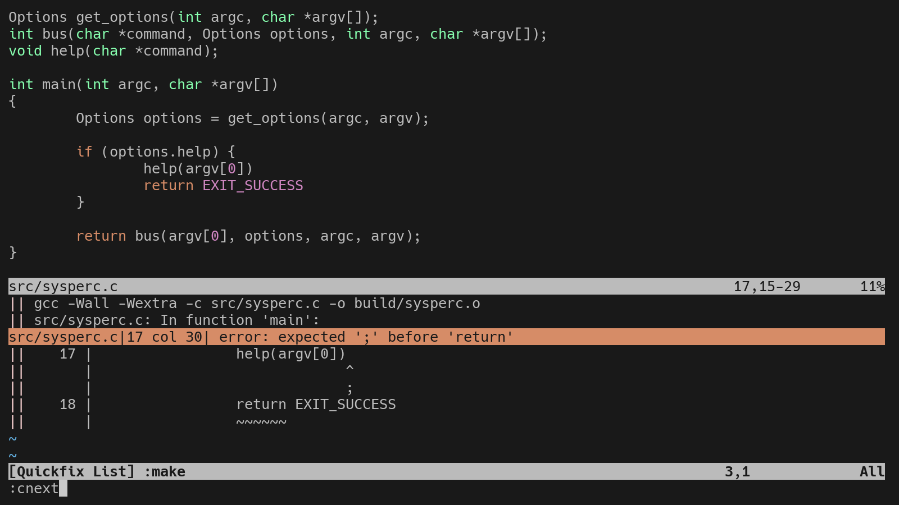
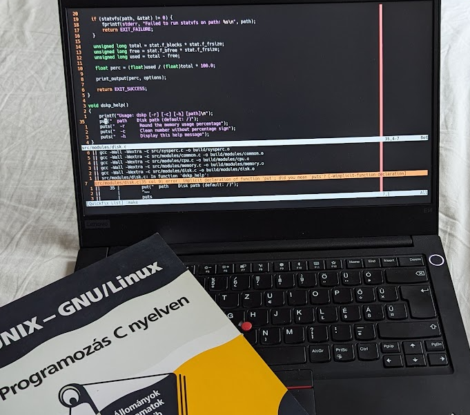

+++
date = '2025-11-21T14:58:17Z'
draft = false
title = 'Edit-Compile-Edit Cycle in Classic Vim'
+++

The only workflow we will need after the apocalypse is already built into classic Vim. So bye-bye... You won't escape that easy! Let's check how to improve it, and why to do so. (And of course, without plugins.)

<!--more-->

Just to be clear, the edit-compile-edit cycle is the act of editing one's glorious code, trying to compile it, then editing again, which hopefully means all the previous compilation errors will be resolved. And the wheel turns, again and again...

This is an addendum to: [Birth of a Minimalistic CLI Development Environment](/posts/birth-of-a-minimalistic-cli-development-environment-i/)

## The Sentence

The sentence that sentences Vim to death is:

> Vim is only a text editor, not an IDE.

I have an answer to this: You are not an IDE, you're just a text editor! And I have a question as well: Then what the hell is this in this picture?



Well, yes, these are missing semicolons, but that is not the point. The point is that without any configuration or plugin, compilation can be started from Vim, and issues can be jumped to and fixed. This works automatically with C, for example, so I will deduce (without doing any investigation) that Vim was indeed mostly written with Vim, facilitating the edit-compile-edit cycle.

Does that make it an IDE? Well, it depends on what we mean by "integrated". It does not ship with the tools that it uses, like a compiler, the development environment is the whole system itself, and Vim integrates with it. So make your own mind up. _I personally would avoid calling it an IDE, because those are expected to be centralized and Vim is used in a decentralized system._ Checkmate for myself, I guess...

## Multi-Language Party

The backbone of the edit-compile-edit cycle in Vim is a command. It runs the program defined in the `makeprg` option. Its default value is **make**, which can be called with the `:make` command to run the default **make target**. This is a lot of _make_, I hope it _makes_ sense (ha!)

The output of the `:make` command will populate the **quickfix** list with any errors or warnings that the compiler outputs. You can then navigate through these issues using commands like `:cnext` and `:cprev`, like the ninja you are.

The magic starts when we change the `makeprg`. For compiled languages, this can be a compiler (you can pick up your chin), and for scripts, a linter that will complain to you like an always dissatisfied father.

So let's create a configuration for the three most used languages in a Linux system: C, Shell, and Python. (I know Shell is not one language. Grow up, touch grass! (We are high on parentheses today. (Really.)))

```vim
autocmd FileType vim nnoremap <buffer> <leader>ll :source %<CR>

autocmd FileType sh setlocal makeprg=shellcheck\ -f\ gcc\ -x\ %:p
autocmd FileType sh nnoremap <buffer> <silent> <leader>ll :make<CR><CR><CR>

autocmd FileType python setlocal makeprg=ruff\ check\ --output-format\ concise\ %
autocmd FileType python nnoremap <buffer> <silent> <leader>ll :make<CR><CR><CR>

autocmd FileType c nnoremap <buffer> <silent> <leader>ll :make<CR><CR><CR>
```

So by this configuration: for shell scripts, we set the `makeprg` to run `shellcheck` with the `gcc` output format, and map `<leader>ll` to run the `:make` command. For Python we use `ruff`, and for C we just use the default `make`. But for vim config files, we map `<leader>ll` to source the current file.

This does not look good. It has a fair amount of repetition, but not without reason. The first time I wrote a function that decided if the `:source` or `:make` command is needed by file type. But an already registered function cannot call `:source %` because it would source the function itself, so it has to be destroyed and redefined. In the end, I just repeat the mapping for each file type. Send all your **DRY** agents, I don't care. And as a side effect, I do like that the keymap is only registered for the relevant file types.

This is how beautiful it looks with Python code:


Ruff is being rough, the quickfix list is populated, and I am satisfied.

## External Formatting

For text indentation, a single press of `=` is enough, but external utilities such as code formatters can be utilized as well. For formatting C code, the following command would do the job: `:!clang-format -i %`. As with any external command, the standard input is the content of the current buffer, and it will be overwritten with the standard output of the command, meaning the memory representation of the file will be updated, in our case, formatted.

This poses one problem: since the whole buffer is being overwritten, the cursor position will be lost. That is very sad, flowers are dying. This situation can be solved with this function:

```vim
function! FormatWithCursor(cmd) range
    let l:save_cursor = getpos(".")
    if a:firstline == a:lastline
        execute '%!' . a:cmd
    else
        execute a:firstline . ',' . a:lastline . '!' . a:cmd
    endif
    call setpos('.', l:save_cursor)
endfunction
```

The command itself is the input argument, and the restoration of the cursor position is handled internally. Setting up mappings for formatting and range formatting in Python files will look like this:

```vim
autocmd FileType python nnoremap <buffer> <leader>lf :call FormatWithCursor('ruff format -')<CR>
autocmd FileType python vnoremap <buffer> <leader>lf :call FormatWithCursor('ruff format -')<CR>
```

## The Reason

The original reason for the **"Minimalist CLI Development Environment"** was to create an environment with low footprint but tailored to my convenience. These functionalities has another reason for existing: distraction-free programming. After dipping my toes into C programming, I had to realize that I need to go back and spend some quality time learning. So I pick up this setup, a book, and a coffee, and just roll.



_Yes, another hungarian book, what can I say, I still find literal technical translations funny._
