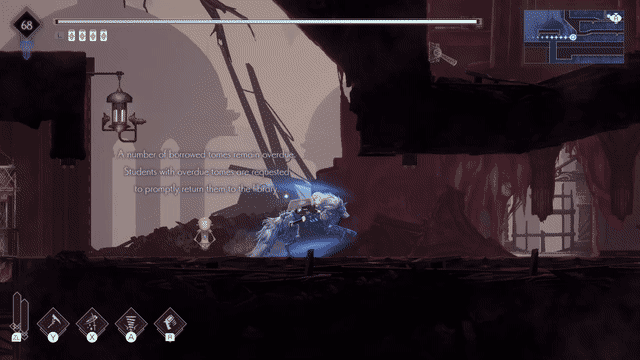

+++
date = '2026-08-30T14:46:35Z'
draft = false
title = 'Ender Magnolia, GIFs and Hugo Shortcodes'
+++

I've never written anything specifically video games before, but recently I played trough a game called **Ender Magnolia**, and I wanted to share two cool examples about how the mechanics can elevate each other. As you can see I did not do that...

<!--more-->

## Creating Clips in the 90s

In the beginning I recorded two short clips, which were saved as `mp4` files. Like none of anyones business, I converted them to `gif` with help of the holy mother of softwares, `ffmpeg`.

```bash
ffmpeg -i double-pressure.mp4 double-pressure.gif
```

Shame on me but I never checked the file size until I tried to push them to the repository, GitHub grab my collar and said: "Dude this file is more than 100 megabites...". I don't have that original clip but for comparison:

```bash
-rw-rw-r--  1 me me  45M Sep  6 14:27 double-pressure.gif
-rw-rw-r--  1 me me 6.2M Sep  2 18:13 double-pressure.mp4
```

A gif is a sequence of individual images for every frame and it is not compressed, at least I did not compress it. (**Side Story:** This should have been trivial to me, because the first ever website I created was a gif gallery of my own creations, and I did all the frames by hand.)

I tried to make the situation better with `ffmpeg` parameters which looks like a text from some shamanistic ritual, but they are quite important.

```bash
ffmpeg -i double-pressure.mp4 -vf "fps=10,split[s0][s1];[s0]palettegen=max_colors=32[p];[s1][p]paletteuse" double-pressure.gif
```

The source video resolution is 720p, I wanted to keep that. Frame per second is reduced to ten, and the color palette is reduced to 32 colors. The output is quite ugly, but at least the file is still huge: `22M`. This is how it looks after the resolution is halved:



To be frank this would work, now it's `5.9M` which is smaller than the original clip, but we can do better.

## A More Desirable Approach

A thought using another format would be more sufficient, I wanted to convert the clip to `webm` format, which is a video format that is supported by most browsers. This format as other video formats uses **motion vectors** to compress the video, to track changes between frames. This is more efficient than compressing every frame individually until we cannot even process what we see.

```bash
ffmpeg -i double-pressure.mp4 -c:v libvpx-vp9 -b:v 0 -crf 30 -an double-pressure.webm
```

The important part of the command that is `libvpx-vp9` codec is used, which is an open source codec provided by Google for the `webm` format. Also the `-crf` parameter is used to control the quality of the output video, where lower values result in higher quality. `-an` is used to disable audio, since we don't need it for this clip.

This site it built with a static site generator, namely **Hugo**, it generates html from markdown files. Gifs could already be embedded as images, but there is no template for videos, yet!

This site already has it's own theme, so only a **shortcode** is needed to embed videos. This is a template file which lives in the themes folder structure in its dedicated place with the following content:

```text
<video width="100%" autoplay loop muted>
    <source src="{{ .Get "src" }}" type="video/webm">
</video>
```

This html will embed a video player that plays the video in a loop, muted and without controls. The `src` parameter is passed to the shortcode, which is the path to the video file. The shortcode can be used in the markdown file like this:

```markdown

```

## Jump Combo




## Double Pressure



