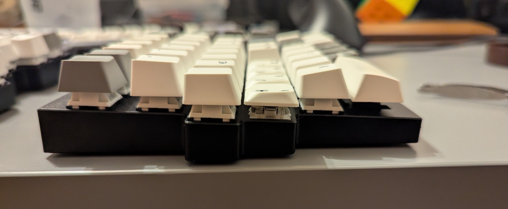

+++
date = '2025-10-18T17:49:43Z'
draft = false
title = 'From Q11 to K11 - A Tale of Keyboards'
+++

This is a chronicle of finding the chillest keyboard after a lot of trials. I tried out a good many things and ended up loving simplicity (well, relatively) and ease of use the most.

<!--more-->

## The "Hobby"

So what is this "hobby"? It was keyboard building. Nowadays it's like a _consumerist Lego party_, but disregarding my tone, it has merits. The best thing about it is that the components of a keyboard are interchangeable, and it's mostly an easy affair. There are keyboards where you have to solder, but most branded mechanical keyboards are not like that.

So the "hobby" is building and customizing mechanical keyboards, with components like the board, a case, switches, and keycaps. In most cases, they are programmable as well, but [that story has been told](/posts/create-custom-keyboard-layout-with-qmk-for-no-reason).

## Keychron Q11

In the beginning I have to state: most of the keyboards I tried are **Keychron**. This fact does not have any complicated explanation or brand loyalty. They are very accessible in Hungary, and I'm satisfied with them.

I had a very cheap _epic gamer_ mechanical sixty percent keyboard. It had brown switches and a hollow sound profile, and I quite liked it. I even employed some [software remapping](/posts/making-a-better-keyboard-layout) for a better typing experience.

Since I liked it, I wanted to try out something more comfortable. I checked out some keyboards with an "Alice" layout (they will come up a lot). In the end, I chose to try out a full split keyboard, so I got a **Q11**.

This keyboard used to look quite different. It came with **Gateron Brown Switches**, which I really liked, and some keycaps that I liked less. The first thing I changed were the keycaps, it got some double shot PBT keycaps with light colors, because I like the contrast with the body.

I would not say that the switches were loud, but I wanted to try silent switches. I tried **KAILH Silent Brown** switches, which were not really silent, but otherwise decent, and later **Akko Penguin Silent** switches. The latter are tactile like the brown. It's a common complaint that these switches feel "smushy", it's true, and I loved it.

But in its current state, as in the picture, it transformed into a low-profile keyboard. The star of this post is another low-profile keyboard coming up later, which inspired me to try to transform the **Q11**.

## Transform MX Switches

There are multiple types of low-profile switches and none of them are compatible with MX switches. The very simple reason is that they have pin positions elsewhere, so they would need a different board.

But there is a switch for solving this problem: the **OUTEMU GTMX Low Profile Switch**. It's more like mid-profile, but still lower than an MX, so that is great.

_Left: **Gateron Brown**, Right: **OUTEMU GTMX Low Profile**_

Assembling it is quite a simple job, I just had to change the switches and keycaps. I made a picture during the procedure to show the difference:

The current switches are somewhat louder than other brown switches, and the keyboard itself only has some factory-applied tape mod, so it could sound better. I take this sacrifice for having the switches in the open, outside of the body, because that is an aesthetic I really like. I did not find a silent alternative, maybe one day.

If someone wants a split keyboard with a staggered layout, from me this is a hard recommend. It's not cheap, but it's affordable compared to other split keyboards.

## Cidoo ABM066

Alice keyboards still bugged my mind, so I went for a used budget option that I found by accident (if checking used hardware sites like a rabid animal qualifies as an accident). It was barebones, meaning no switches and keycaps, but I think you figured out that I have enough at home already.

This was a very pleasant introduction to Wonderland (you know, Alice, haha, joke), and I maybe, perhaps, possibly would recommend it with one caveat.

This keyboard is advertised as **VIA** compatible (a keyboard layout customization software), which is true, but the firmware that is shipped with this keyboard does not support all the functionalities that **VIA** provides.

It's a shame because the white variant that I got has a really good old-school hardware feeling and it is very comfortable.

I used it with the **Akko** silent switches, and sold it with the **KAILH** ones. They can go to hell, they were not silent! Yes, I'm still grumpy about that, even if they are decent switches.

## Keychron Q8

This keyboard is special because of two things: at the time they were around half the price in all Hungarian stores (they are older models, but still!). This was the first keyboard I laid my eyes on.

So the price was already covered by the late **ABM066**, I still had enough tools to populate a barebones keyboard, so what is the harm?

Well... This will be a disservice to this keyboard, but I don't really like it.

Mind you, I would recommend this keyboard more than the **ABM066**, because most of the keyboards are as bulky as this one and most people seem to like it. And more importantly, this is a fully programmable keyboard with **QMK** firmware.

The good thing is that this keyboard is very durable, but the bad thing is that it's freakin' huge because of it. I do like the fact that it's almost two kilograms, so I can kill a bear with it if there's a situation. And the typing experience itself is good. But in the end, it's just not comfortable enough. I used it with palm rests, I typed with floating hands (which is the way), but it never felt right and I feel this is related to how its body is constructed, not to the layout.

## Keychron K11

So this is the keyboard that made me want to write this heroic tale.

The reason why I know **Q8** had no problem with the layout is that I really like this keyboard, and it has the same one. But check out this size difference:

**Q8** would eat two or three **K11** for a snack. When I wanted to try this keyboard, I had not made the "low-profile" mod on the **Q11** yet (yes, this is time travel), so I did not know how I would like the low profile. The reason for the trial is that I wanted more comfort, and the other keyboards seemed to tire my hands more than my laptop keyboard.

This keyboard surprised me with:

The **Gateron KS-33 Low Profile 2.0 Mechanical Switches** (wow, that's a name...) are a bliss, and paired with the default keycaps they are much more comfortable than I expected. Key presses still have a nice travel, and tactility can still be felt. This profile gives me every benefit of a mechanical keyboard typing experience, just better.

The board has some additional stabilizers that fit the factory keycap set, which helps the sound of the Shift, Enter, and Backspace keys, while keeping compatibility with other keycap sets. Altogether, this keyboard sounds quite nice, it has some foam by default in the case.

It has USB 2.4GHz and Bluetooth connection, which I used to look down on because "big boys deal with cables". I can use this keyboard easily with my Android phone to change the world in Termux, that's all I say...

And it turned out I really like that it's a unibody keyboard. **Q11** was quite a hassle to travel with, **Q8** was even bigger and heavier. This keyboard can be placed and replaced easily, and even fits on my laptop right now.

I did some side adventure with **Gateron Red Low Profile** switches. For me it's a hard pass. It has a similar operating force to the brown ones. The problem is, since it does not have a pressure point, for me it feels harder to press than a tactile switch. Maybe it's silly, but I'll listen to my hands.

I certainly recommend this keyboard, it's feature-rich and chill as hell.

## The E Word

One more thing before we get to our tearful goodbyes! There is one word that did not come up yet: **Ergonomics!** All of these keyboards can offer enough ergonomic advantages, or those advantages can be questionable if they are not meeting your needs.

Having a split layout is a plus in itself, and it has a very nice side-effect: there are more keys for the thumbs. Especially in the Alice layout keyboards, there are two spaces, two keys in the middle, and technically the second B key can be used by a thumb as well. I don't do anything wildly unconventional with those keys, only some layering and tap-hold bindings, but they are the best thing about these keyboards. Also, low profile can be viewed as an ergonomic feature, do with this statement what you like.

I bid you farewell, spend less on keyboards.
