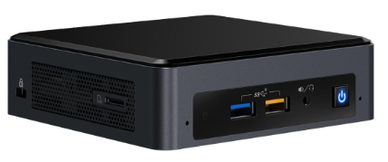

There comes a time when I cannot manually share every video that my family needs. I need a media server. So I create one... or I just install some stuff.

<!--more-->

I have an **Intel NUC 8** mini pc, it's a beautiful little beast, with too much power in too little space. Four years ago it passed the normie IT dude benchmark with flying colors. Which means it ran **Windows 10** with **WSL 2** and **IntelliJ** indexing was very fast in huge projects.

A lot of time has passed since then. **NUC** is now produced by **ASUS** (when did that happen?), I used laptops as my main workstations, and I have a **Raspberry Pi** as well. But it was time to use this little overpowered machine again.

## Media Server

I already wanted to use **Jellyfin** for a long time. It's a free software that allows you to collect, manage, and stream your media. It's like **Plex**, but free. It seemed fairly easy to setup. My instinct was to set up some automation (mandatory **Ansible** mention, but I feel like I speak more about Ansible than I use it, but love is love what can I do) which installs and sets up **Jellyfin**.

Then I asked my friends how they approached their media server setup. They are using **OpenMediaVault** as an OS, which was really promising, but all these things started to feel too complicated to me.

So instead of any serious work I set up a **docker compose** configuration for **Jellyfin**, chose the volumes, and started the service. Easy peasy, serve me pleasy.

## Sound pollution

Everything was fabulous, except that **NUC 8** is not only known for its power but also for its noise. Idle mode sounds like a parking helicopter with engines turned on. I won't lie, this was not an easy fix. I read some articles and blog posts, so I ended up in the **BIOS** of that machine. (We're having graphical BIOS interfaces, what's up with that, not so stylish).

I tried multiple Fan Control profiles, none of them solved my problem. I could not underclock the CPU, but I managed to choose a power saver profile and disabled Turbo Boost. This may sound bad, but home video streaming only uses 10% of the resources or less.

It was almost good, but what solved the problem was increasing the threshold temperature for the fan to start spinning. I set it to 60 degrees and lowered the minimum rotation speed. (The temperature is between 38 and 49 degrees, soon we'll find out how I know this.)

The infamously loud **NUC 8** is silent now. It's in the bedroom, so that's a big win.

## Monitoring

Since I changed settings related to the heat of the machine, I wanted to monitor it. The first couple of times I checked it through an SSH connection from my mobile phone, which is really _hackerman_ style but also very uncomfortable.

I started to work out a really advanced plan where **Prometheus** collects data from the host computer, and I will have a **Grafana** dashboard for visualizing said data. Now that is something that would take time, and when I was researching this I came across a software called **Cockpit**. It's a software that provides a web interface for monitoring and managing Linux machines. It's beautiful, I can monitor all the hardware information I need, check services, logs, updates, and a lot more.

I installed it, and I'm happy with it.

This was a tale of not developing anything, but installing software. Sometimes that's enough.
