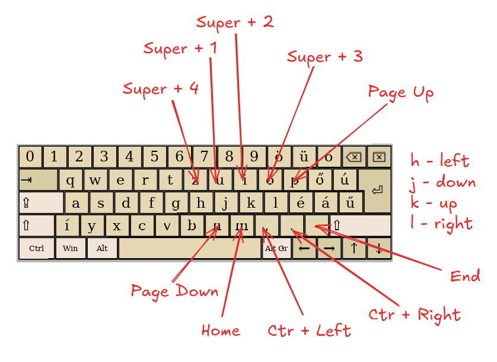

_Sorry man, still qwertz, this is about navigation and comfort_

Let me introduce you to my keyboard layout modifications, which make the most useful use of the Caps Lock key and adds a navigation layer.

<!--more-->

## Choosing the right software

I'm writing these words with my first very, very cheap mechanical keyboard. It's a 60% White Sark keyboard with some soldered-in brown switches.

It is a typical gaming peripheral, which means it is either:

- **Cheap** and low quality and **has RGB**, but can be good for some people
- **Overpriced** and low quality and **has RGB**, but can be good for some people

The 60% layout is missing some keys, most notably the arrow keys, which are used by most programs. So I wanted to find a remapping solution that is easy to configure and whose configuration is portable.

The first one I checked was **xmodmap**, but that program is tied to the X server, and at the time, my workstation used Wayland.

The second one was **kmonad**, which is configured with Haskell. _(Yes, that is the end of the sentence.)_ In the future, I want to learn it because it looks like a really cool cross-platform alternative.

The winner was **[keyd](https://github.com/rvaiya/keyd)**, which is a daemon that listens to keyboard events and can be configured with a simple configuration file. You clone the repository, build it, and add it to systemd like a real computer user.

_If you think I should not use **systemd**, there is no need for a fistfight; please write a passionate letter about it, and we will keep it in the refrigerator for posterity._

## This Caps Lock goes to heaven

I want to present the usage of **keyd** in one line, which will make the Caps Lock key useful, instead of ... well, Caps Lock.

Create the file `/etc/keyd/default.conf` with the following content:

```
capslock = overload(control, esc)
```

Some people remap it to Esc, and some older layouts have it as Control, but rejoice everyone, **it's both**.

If you have a not-so-dumb mechanical keyboard with **qmk** _(we're getting there, my dude, just not today)_, you may refer to this as Tap Hold. Let me spell it out for other well-adjusted people with less expensive hobbies: when you tap **Caps Lock**, it's **Esc**, and when you hold it, it's **Control**.

Honestly, when I tried this, I was learning touch typing (for the 20th time, mind you), and I thought it was a really stupid idea. But in practice, it was so comfortable for me.

## Buttery smooth navigation

I still had one problem: the arrow keys. You just cannot **hjkl** everywhere like there's no tomorrow.

So I met another concept which is provided by **keyd** as well: **layers**.

No **qmk** and **expensive keyboard** jokes this time...

You already use layers in your keyboard; for example, when you press **Shift**, you are in a different layer. I just created another. When I hold **Tab**, it activates the navigation layer.

The configuration is the following:

```
tab = overload(nav, tab)

[nav]

h = left
k = up
j = down
l = right

u = M-1
i = M-2
o = M-3
y = M-4

n = pagedown
p = pageup
m = home
, = C-left
. = C-right
/ = end
```

Yes, you're right; that beautiful **overload** method works with layers as well.

I am really not in the mood to spell out this configuration, so I made a nice drawing for you:



To make this comfortable, I used keys from the right side, since **Tab** is on the left side. The super + number mappings are for workspace switching. It may look odd that it starts from **4**, but having **1** above my index finger is really nice. The other keys are for navigation in any non-keyboard-centric programs.

This whole mapping has one added benefit I like: it works with the laptop keyboard as well.

So check out **[keyd](https://github.com/rvaiya/keyd)**; it's a really cool program. I'm really happy with it.
