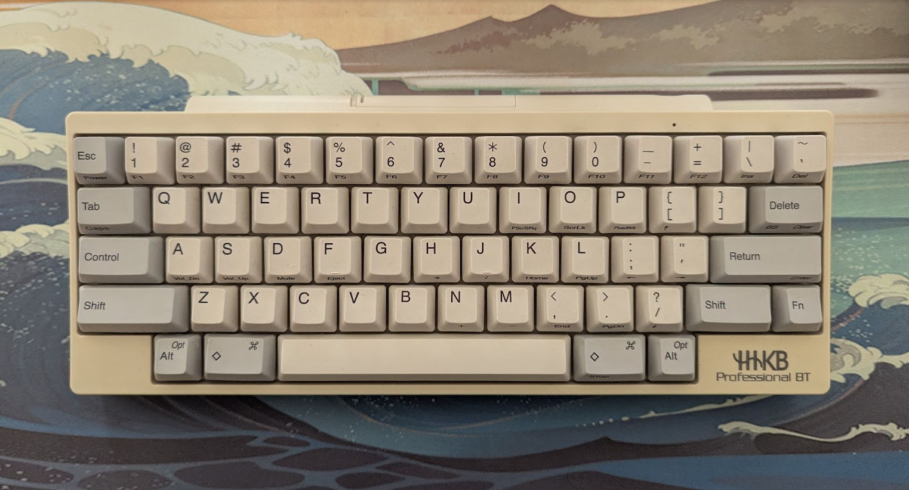

+++
date = '2025-12-14T15:57:07Z'
draft = false
title = 'One Month With the HHKB'
+++

I got a hold of a legendary keyboard! Some people find it the best invention since the wheel, while others think it's nonsense wrapped in plastic. Let me present: _A highly unimpressive review of a slightly impressive keyboard._

<!--more-->

If you're not familiar with the **H**appy **H**acking **K**ey**B**oard, it's a compact sixtyish-percent keyboard aimed at programmers (and some of them were shot successfully). Its layout puts Control where it always should be (Caps Lock), among other small changes. The keyboard is famous for its **Topre** switches, which are a hybrid between mechanical and rubber dome switches, although, in the end, they are rubber dome indeed. It is also infamous for its price, which is usually north of $250.

I got my hands on an _**HHKB** Professional BT_, which is a cursed model that **only** comes with Bluetooth connectivity. Not optimal, but since I got it used for a good price, I didn't mind too much.

I need to express the most important thing: I am actively creating situations to use this keyboard because of the typing experience.

## Layout

This layout is inspired by early _IBM PC_ keyboards and the _Apple M0110_ (at least, I guess). The main layer has some minor changes compared to standard layouts: Control, Escape, and Backspace/Delete are moved to more accessible positions, and the two bottom corners are left empty. Vim dorks love this keyboard for its layout, and it makes sense. I also really like these layout changes on the surface, but the but comes later...

The less impressive part is the function layer. It is designed to be used with one hand for most of the keys, and I hate that. The navigational cluster is quite funky as well, and I'm not in the mood for dancing. If you start with this keyboard and get used to it, I think it's fine, but since I have [my own idea for an ideal layout](/posts/making-a-better-keyboard-layout), this is not impressive for me. So I use this keyboard with the same software remap that I always use. (I did use it with Termux without a remap for a while... don't worry, I survived.)

## Vibes

Your impeccable memory serves you well: I had some nice things to say in the beginning. Let's repeat it to make this sorry excuse for a review longer. I really like the typing experience (my friend who has a _"mushy"_ keyboard allergy did not like it, though). For a grasp of my taste: I love brown and silent tactile switches, and for me **Topre** feels like something in the middle. Ironically, I think the plastic body and dome construction help the sound profile and feel a lot. And as you can see in the picture with your beautiful doe eyes, the aesthetics are quite pleasing as well, as long as aesthetics means "plain beige plastic". Jokes aside, I seriously love the look.

So I wrote my piece! Now everyone knows I have an **HHKB**, online status signaling achieved.

P.S. I think all reviews on this subject should include a quote about cowboys, horses, and saddles, such as: _"A horse can eat your computer, but you'll still have your keyboard with a horrible function layer... at least it's good to type on."_
