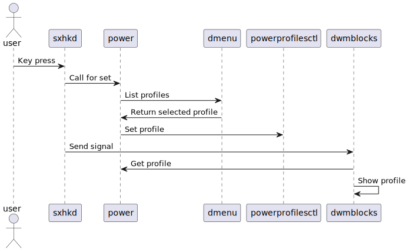
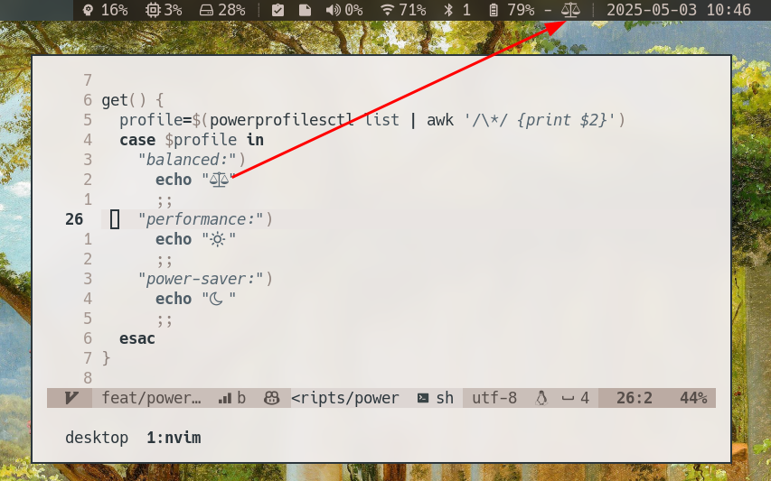

If you are a normal well balanced person, you possibly install a distro with a desktop environment, and when you want to change your power settings you search for the menu and just do it. In this part of the world this is not how we do things, sorry.

I did archived [what I lost when I changed for a **window manager**](/posts/the-many-lessons-of-building-dwm/) and [how did I create a new status bar with **dwmblocks**](/posts/replace-slstatus-with-dwmblocks-while-contemplating-performance/). Now the time has come to implement a power management feature.

<!--more-->

## Power!

For some time I managed cpu fequency by setting the desired **governor** manually, such as `performance` or `powersave`.

```shell
echo performance | sudo tee /sys/devices/system/cpu/cpu*/cpufreq/scaling_governor
```

I'm not an animal, I did not type this command all the time, I used a script that collects the available governors and the could be selected from a list with the beloved **fzf** command line tool.

I did not have any problems per se, but another topic came into my attention.

## Battery!

I found another tool called **tlp**, which optimizes laptop battery life automatically. It uses two profiles, **ac** and **bat** (I'll let you find out what they mean). And it does cool stuffs like changing cpu power when there is no work done. And it can be configures which **governor** should be used with said profiles. Aaand it optimizes power consumption of other devices as well. It is neat!

It's really easy to set up and it has great [documentation](https://linrunner.de/tlp/index.html).

## Profiles!

I became curious how power management works in fully featured desktop environments like **GNOME** and **KDE**. It seemed to me that they are using a tool called **power-profiles-daemon**. That sure sounds something that manages power profiles and is possibly summoned with **systemd**. And yes that what happens indeed.

There was one bad news, **tlp** and **power-profiles-daemon** are conflicting services, because they are manipulation similar part of the system. What I gathered from the _interwebz_: **tlp** is better for battery life, but for manual profile selection the tool is **power-profiles-daemon**. So for the time being I will use the latter.

## Implementing power management. (No more exclamation mark)

So **my** desktop environment, uses a set of tools that are working together to make this happen.

- `powerprofilesctl` - is the tool that is provided by **power-profiles-daemon**, for managing the power profiles.
- `dmenu` - is a gui fuzzy finder, it will provide a selectable list of profiles.
- `dwmblocks` - is a statusbar, which will show the current profile.
- `sxhkd` - is something that is very hard to remember and type and it is responsible for key bindings.
- `power` - a shell script by me that handles interaction with `powerprofilesctl` and `dmenu`, and shows an icon representation of the profile.

Now that is decentralized as hell, so lets visualize what happens, when a key combination is pressed for changing profile.



So that may look like a lot, in practice I added a new shell script, a new keybinding and a new block for dwmblocks. Calling `power set` will open **dmenu** and set the profiles, calling `power get` will echo an icon.



So this is how you manage power profiles in two hours of work instead of clicking a button. You're welcome.
