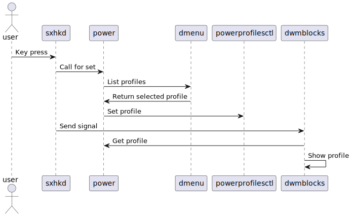
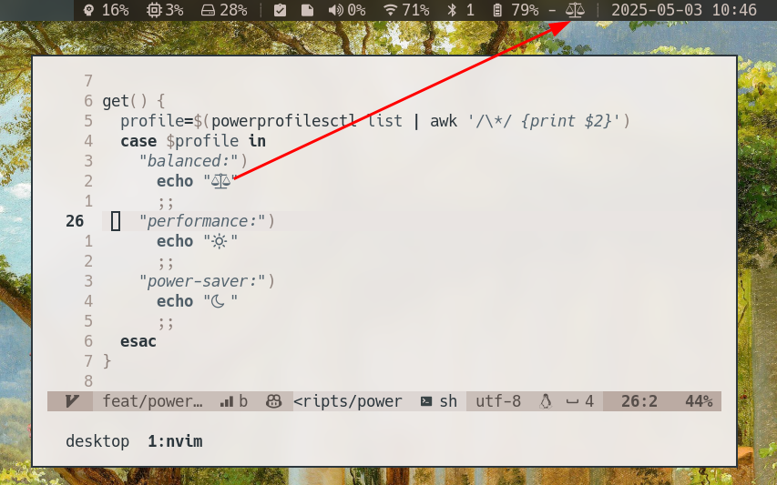

If you are a normal, well-balanced person, you probably install a distro with a desktop environment, and when you want to change your power settings, you just search for the menu and do it. In my world, this is not how things are done—sorry.

I have already documented [what I lost when I switched to a **window manager**](/posts/the-many-lessons-of-building-dwm/) and [how I created a new status bar with **dwmblocks**](/posts/replace-slstatus-with-dwmblocks-while-contemplating-performance/). Now, the time has come to implement a power management feature.

<!--more-->

## Power!

For some time, I managed CPU frequency by setting the desired **governor** manually, such as `performance` or `powersave`.

```shell
echo performance | sudo tee /sys/devices/system/cpu/cpu*/cpufreq/scaling_governor
```

I'm not an animal—I didn't type this command every time. Instead, I used a script that collects the available governors, which can be selected from a list using the beloved **fzf** command-line tool.

I didn't have any problems per se, but another topic caught my attention.

## Battery!

I found another tool called **tlp**, which optimizes laptop battery life automatically. It uses two profiles, **ac** and **bat** (I'll let you figure out what they mean). It does cool stuff like changing CPU power when there is no work being done. You can also configure which **governor** should be used with each profile. And it optimizes power consumption of other devices as well. It’s neat!

It's really easy to set up, and it has great [documentation](https://linrunner.de/tlp/index.html).

## Profiles!

I became curious about how power management works in fully featured desktop environments like **GNOME** and **KDE**. It seemed to me that they use a tool called **power-profiles-daemon**. That certainly sounds like something that manages power profiles and is probably started with **systemd**. And yes, that is indeed what happens.

There was one downside: **tlp** and **power-profiles-daemon** are conflicting services because they manipulate similar parts of the system. From what I gathered from the _interwebz_: **tlp** is better for battery life, but for manual profile selection, **power-profiles-daemon** is the tool to use. So, for the time being, I will use the latter.

## Implementing power management. (No more exclamation mark)

So, **my** desktop environment uses a set of tools that work together to make this happen.

- `powerprofilesctl` – the tool provided by **power-profiles-daemon** for managing power profiles.
- `dmenu` – a GUI fuzzy finder that provides a selectable list of profiles.
- `dwmblocks` – a status bar that shows the current profile.
- `sxhkd` – a tool with a hard-to-remember name that is responsible for key bindings.
- `power` – a shell script I wrote that handles interaction with `powerprofilesctl` and `dmenu`, and shows an icon representation of the profile.

Now, that’s decentralized as hell, so let’s visualize what happens when a key combination is pressed to change the profile.



So, while that may look like a lot, in practice I just added a new shell script, a new keybinding, and a new block for dwmblocks. Calling `power set` will open **dmenu** and set the profile, calling `power get` will echo an icon.



So, this is how you manage power profiles in two hours of work instead of just clicking a button. You’re welcome.
