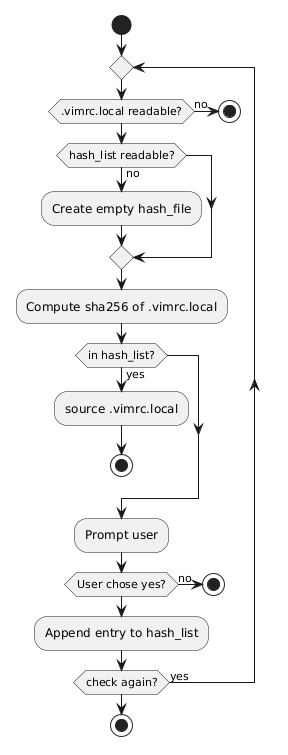

+++
date = '2026-05-17T18:00:38Z'
draft = false
title = 'Reimplementing Local RC With Vimscript'
+++

This title may seem strange, so let's break it down. **Reimplementing** means implementing again, **Local** means not remote, **RC** stands for "Run Commands", and **Vimscript** is something to look at if you want to blind yourself.

<!--more-->

Fabulous old **Vim** has an option called `exrc` (legacy alert!), which allows the execution of a configuration file that is located in the current directory. This is basically poor man's project-specific configuration. For a time I did not know that this option existed, I had some **Vimscript** do this dirty work for me: looking for a `.vimrc.local` file in the current directory and sourcing it.

So I happened to find out about `exrc` and I was ready to drop my silly little code until I inspected the situation. When `exrc` option is set a list of files is checked for existence and will be executed without any question or resistance. This is very similar to what I did, but further investigation led me to another option called `secure`. So big surprise: if you execute files willy-nilly, that is a security concern.

So what is `secure`?

> When on, ":autocmd", shell and write commands are not allowed in ".vimrc" and ".exrc" in the current directory and map commands are displayed.
>
> -- <cite>VIM - Vi IMproved 9.1 (2024 Jan 02, compiled May 23 2025 00:48:59)</cite>

This poses at least some problems:

- Dude I may want to execute shell commands.
- There can be a version of **Vim** which has `exrc` but not `secure`.
- Also **Neovim** has these options but handles them with a trust mechanism, I want that!

There were multiple versions of this "reimplementation". First it just read a certain file called `.vimrc.local` if it were present in the working directory and sourced it. After that I added a prompt to ask the user to trust the file and stored all trusted paths. That raised a problem, trusted files can be changed so they should not be trusted anymore. So in the end I added the hash of the file to the trusted paths. Witness!



There is a full recursion which is not necessarily necessary, but I find the recursive call expresses a clearer intent in the implementation than an ad-hoc loop. This is not the best choice, but mine.

The hash entries will look like this:

```
/home/user/workspace/very-nice-project/.vimrc.local|e3b0c44298fc1c149afbf4c8996fb92427ae41e4649b934ca495991b7852b855
/home/user/workspace/never-finished-rust-project/.vimrc.local|1dac7e4ca536b432953d0609a0e8eef8de3607a6e47c5740d58c168ddb881de7
```

This keeps track of the file path and the hash as well, so if the file changes, the hash will change and the file will not be trusted anymore. This is a simple way to implement a trust mechanism having only a file as storage/state. There is no cleanup, life is hard and short.

Another fun fact is that I used the `sha256` function from **Vimscript** to calculate the hash of the file, not the `sha256sum` or `shasum` command from the shell. The reason is that the function implementation is consistent across platforms, while the command is not. That means this solution needs at least **Vim** 7.4, but what can we do, this is the _UNIX wild wild west_...

In the end I have the local configuration functionality as I want, yet again without plugins. _(At first I wanted to share the script instead of the activity diagram, but you know what big boys say: "That is only an [implementation detail.](vimrc.local)")_
