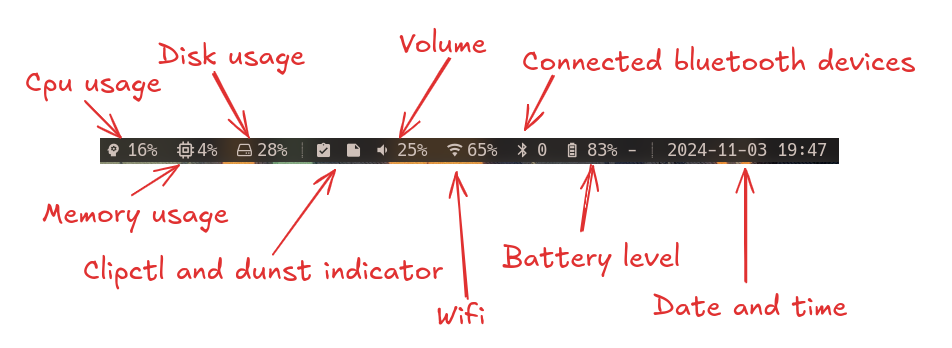

If the following words mean nothing to you, you may find this post confusing: `slstatus`, `dwmblocks`.

The short explanation is that they are status bars. The long explanation is the same, but the interesting thing is not what they do, but how they do it.

<!--more-->

These two status bars are primarily aimed to be used with the `dwm` window manager. This window manager has two important properties that make it different from others: it has the best window management implementation (tags > workspaces). And it is intended to be compiled by **you**.

In the words of the suckless team:

> Because dwm is customized through editing its source code, it's pointless to make binary packages of it. This keeps its userbase small and elitist. No novices asking stupid questions.

So, a small and elitist novice like me needs a small and elitist status bar.

_(Enough of dwm, if you want to know more about why it is great, check this [video](https://www.youtube.com/watch?v=gxwTATmWRSE), or my older [post](/posts/the-many-lessons-of-building-dwm))_

For context, the status bar looks like this:



## Slstatus

`slstatus` is a status bar created by the suckless team. It provides components written in C that can show information about your system, and you can customize these components in a header file. For example:

```c
static const struct arg args[] = {
    /* function          format    argument */
    { ram_perc,          "Mem: %s%% ", NULL },
    { cpu_perc,          "Cpu: %s%% ", NULL },
    { disk_perc,         "Disk: %s%% ", "/" },
};
```

This will `printf` the percentage of RAM, CPU, and disk usage like `Mem: 13%`.

The bar itself will refresh at a certain rate configured in seconds. This means all components will be updated at that rate. Moreover, if you want to trigger an update, you can kill the processes. The `killall -s USR1 slstatus` command sends the SIGUSR1 signal to all instances of the `slstatus` process. This signal can be used by `slstatus` to trigger a specific action, such as updating its displayed information.

## Dwmblocks

`dwmblocks` is another status bar that is supposed to draw the results of commands to the bar. These commands can have individual refresh rates and an update signal. For example:

```c
static const Block blocks[] = {
    /*Icon*/	/*Command*/		/*Update Interval*/	/*Update Signal*/
    {" Mem: ", "mem_perc", 1, 0},
    {" Cpu: ", "cpu_perc",	1, 0},
    {" Disk: ", "disk_perc", 1, 0},
    {" Vol: ", "alsa_perc", 0, 14},
};
```

Please note that in `slstatus`, `mem_perc` is a component, whereas in the case of `dwmblocks`, it's a command, more precisely a **shell script**.

This configuration means that memory, CPU, and disk usage will be updated every second, and the volume will be updated only when signal 14 is sent: `pkill -RTMIN+14 dwmblocks`

## Performance

So we have two status bars:

`slstatus` which updates all its components at a single rate and can be triggered to update all components at once, but said components are written in C.

`dwmblocks` which updates its components at individual rates and can be triggered to update a single component, but said components are written in shell scripts.

This is a good old trade-off. Handling update rates separately is a really good deal because running something sixty times a minute or once (easy math) does make a difference, even if it's a shell script. Or the refresh rate can be zero, which means the value will only be updated if a signal is sent.

You could ask, what is the problem with shell scripts? Well, they are slower since they are not compiled, and depending on one's coding style, they can spawn a lot of processes.

```shell
free | grep Mem | awk '{printf "%.0f%%", $3/$2 * 100.0}'
```

This will spawn 2 additional processes. This is not a big deal in a vacuum, but it is still a performance-related consideration.

But there is a silver lining. The shell scripts can be optimized or replaced with compiled binaries in the future. So for now, I will vote for suboptimal processes with more optimal handling.

## Side Adventure!

There is a **[patch](https://tools.suckless.org/slstatus/patches/signals/)** for `slstatus` for handling individual update rates and signals. This would be the perfect solution for me, but for some reason, the `cpu_perc` component ran on every update. This made me very sad.

So, this was my rambling about optimizing with event-driven signal handling word-salad status bars. I hope you enjoyed it.
