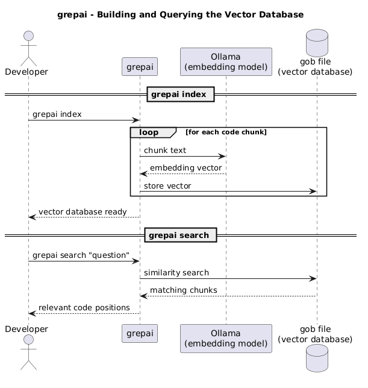

+++
date = '2026-07-10T10:40:53Z'
draft = false
title = 'Semantic Searches Against Codebase'
+++

A local model and a vector database walk into a bar and the bartender asks, _"How do we construct the authorization rules for an admin user?"_.

<!--more-->

In the past month, I was experimenting with setting up a local LLM workflow, which for now is quite a [bust](https://github.com/hrvthzslt/lllm-playground), but there was one tool that I kept and am still using. It accepts questions like the one above, and it will provide a list of code positions that are relevant to the question.

This tool is called **grepai**, which you would assume is pronounced like _"grep AI"_, but since it is not written like that, it must be pronounced _"gre-pai"_ _(Arigato, senpai)_.

It can build a local **vector database** with the help of an **embedding model**, both can be local, and I do indeed keep them local. There would be good reasons to build a shared database for multiple codebases, but for now, I set it up per project. (I mean, I did build a shared one once, it took 3 hours to build and I never used it...).

This **vector database** will be queried by a CLI tool that you invoke with the following command in your interactive terminal session: `grepai`. Huge surprise!

But before you use it, it needs some setup. The local model can be run with **ollama**, so install it however you want, I'm not your mother. Same goes for **grepai** itself.

```bash
grepai init
```

Running this command in your current path (which should be your project root) will ask you for an embedding provider (a.k.a., the tool running the model) and a storage backend (a.k.a., the vector database). I use **ollama** and **gob**, which stores the database in a local file.

```bash
grepai watch
```

This command builds the database and keeps it up to date with changes in the codebase. If you want the database to stay current, this process needs to be running.

```bash
grepai search 'where do we define the authorization rules for an admin user?'
grepai trace callers 'Login'
grepai trace callees 'Login'
```

And voilà, we can use these commands to search our codebase, and trace the callers and callees of a function.



At this point you could ask, _"This is fine, but it does not feel like it is for me."_ And you’re right! Stand aside, puny human, and let the robots do the work. Yes, this tool is quite useful for agents. There are multiple ways that **grepai** provides support for agents, most notably a dedicated skill and an MCP server. I personally use the skill, which details the usage of **grepai** and can be called with `/deep-explore`. The main thing is that you have to find a way to make the agent use the tool for code exploration.

I started using **grepai** because when the agent uses `grep` or `rg`, this would use more tokens, whereas a semantic search possibly provides the correct answer in fewer calls. Although this claim seems logical, I have no evidence to support it. I use it because code discovery is faster with it.

Thank you for participating in this heroic hipster tale of a local LLM workflow, and I hope you find it useful!
