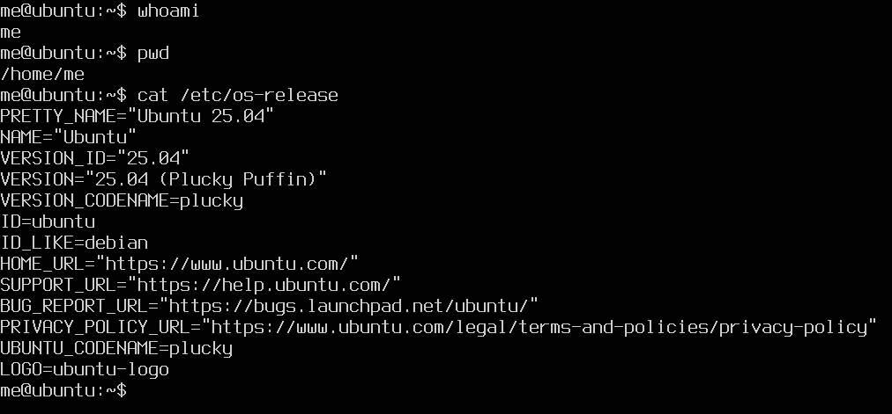
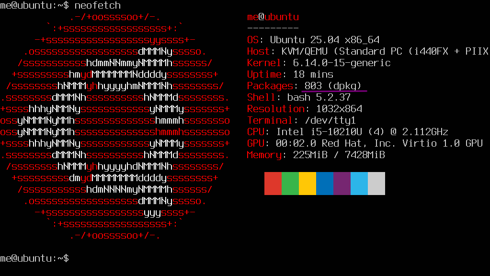
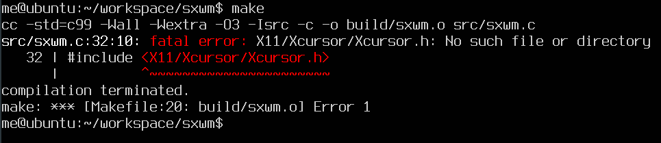
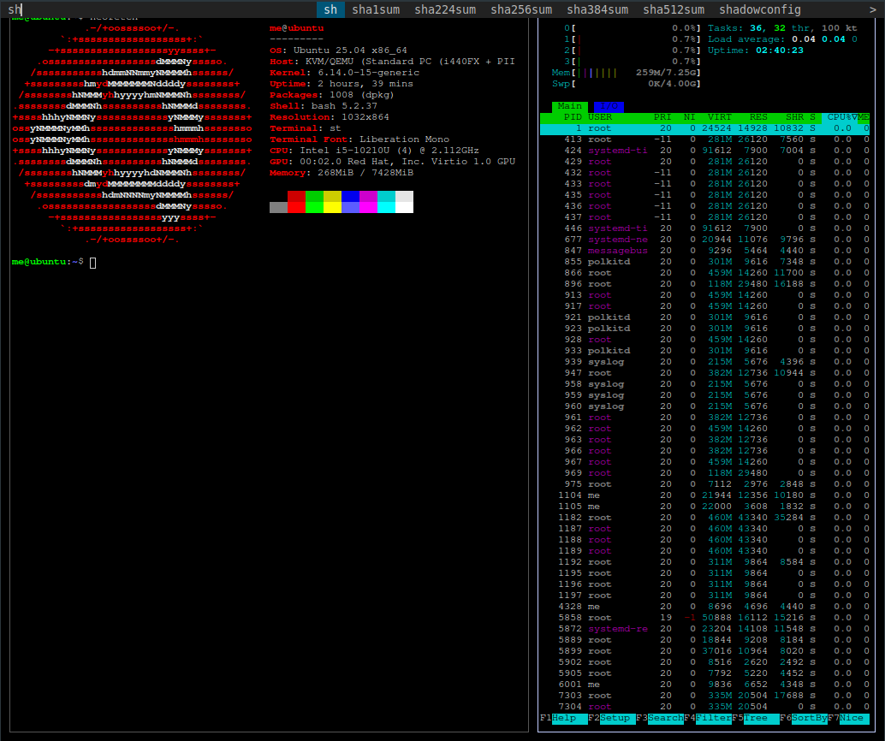

Instead of the ussual rambling I'll make a guide for something that I find really fun. Setting up graphical interface on an OS that does not have one. For this I usually use **Debian** without a desktop environment. We'll check this out on an **Ubuntu Server** because the word "server" emphasizes that is should not have a GUI. But it will!

<!--more-->

## Setting Up Ubuntu

If you expected that I will guide you trough the installation, you will be disappointed. Download the server ISO, install it on machine or a vm, I will use the latter. Finish the installation, do not install any additional packages that could be handy for a server, we won't need them. Do an `update` and `upgrade` and you should see something like this, when you find out who and where you are:



Yes my user is `me`, because me is me, makes sense.

Without starting any religious war, we will remove `snap`. There are a couple of reason: I don't like it, we don't need it and I don't like it. I'm not against **universal package managers**, but for me snap does not feel so snappy, if you like it don't dismiss it.

Luckily in **Ubuntu Server** this is very easy, _it will bite back, but that is part of the fun_. You can check how many snap packages you have with: `snap list`, If you did not install any extra packages this should be zero, which is great snap can be removed. We will remove it, and hold back:

```shell
apt remove --purge snapd
apt-mark hold snapd
```

No snappy snap snaps after this.



## Display Server

We will install **X11**, also known as the **X Window System**, which is a protocol and system that provides the basic framework for a graphical user interface for Unix-like operating systems. It is important to state, that **Wayland** is another protocol, and most Desktop Environment are migrating to that. Both have their ups and down, choosing **X11** is not a statement, it's just the dependency of the window manger we will use.

The easiest way to install it is install **xinit**. Maybe you can guess what is that by name, but from wikipedia:

> The xinit program allows a user to manually start an Xorg display server. The startx script is a front-end for xinit.

This means we'll have a configurable entrypoint, a command called: `startx`

```shell
sudo apt install xinit
```

If you run `startx` you will see a graphical terminal emulator called xterm. You can `exit` or `pkill xinit` if you're an animal.

## Window Manager

At this point you could install **i3** with apt, and add a line to `.xinitrc`:

```shell
exec i3
```

Without knowing the key bindings you may have a "vim" experience exiting from it.

But we're going to do something much more interesting, building one ourselves and it's not going to be **dwm**. Crazy!

We're going to use **sxwm**, a newborn, at the time when I writing this 2 weeks old. The reason it caught my eye is, its layout is very similar to **dwm** but it has a very short and simple config file and it has hot reload. And mostly does everything that I patched in to **dwm**. Check out the [repository](https://github.com/uint23/sxwm), star it if you like it, it's really impressive.

Some general lessons about building software:

- Read the README

Thank you, for your attention. But jokes aside we're looking for the build dependencies and build steps, and we're lucky both are documented. It needs `libX11` and `Xinerama`, and a c compiler as well, let's use `gcc`.

```shell
sudo apt install gcc libx11-dev libxinerama-dev
```

The build steps are `make` and `sudo make install`, it will first build and then copy the binary to `/usr/local/bin`. But something happens when we try to run `make`.



In this cases you can surf trough the _interwebz_ for answer, but I have a better solution. There is a tool called `apt-file` for cases like that. Running the following commands to find out what we're missing.

```shell
sudo apt install apt-file
sudo apt-file update
sudo apt-file search X11/Xcursor/Xcursor.h
```

Now we see that `libxcursor-dev` package needs to be installed, do that. Run `make` and `sudo make install` so **sxwm** is built and installed.

Add the following line to `.xinitrc`:

```shell
exec sxwm
```

Run the command `startx`, and congratulations you see a black screen. I will spare your time, you can exit with `Super+Shift+e`.

By default this window manager has some bindings to suckless tools, we can install them just for trying it out.

```shell
sudo apt install suckless-tools stterm
```

To get a terminal press `Super+Enter`, to show a runner `Super+p`.



This picture called _Two terminals one runner_.

## Ricing!

