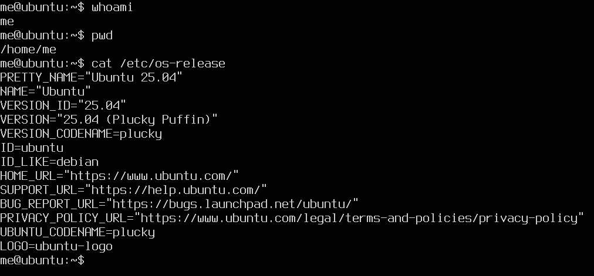
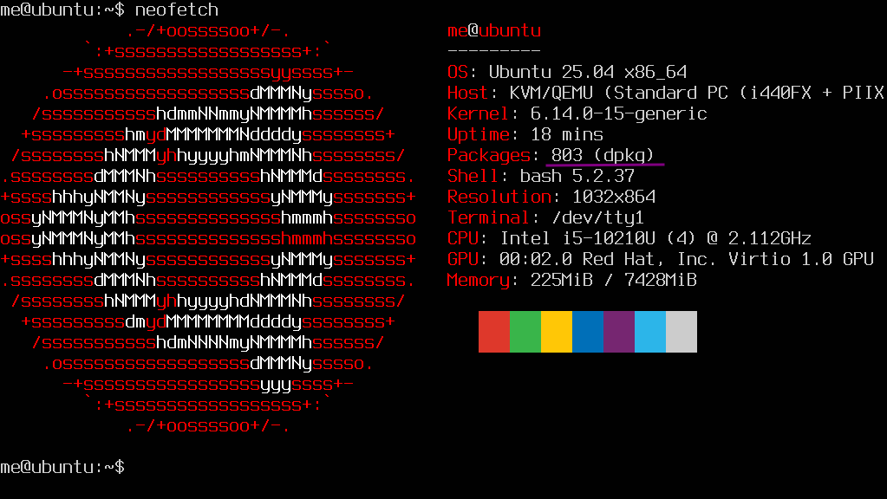
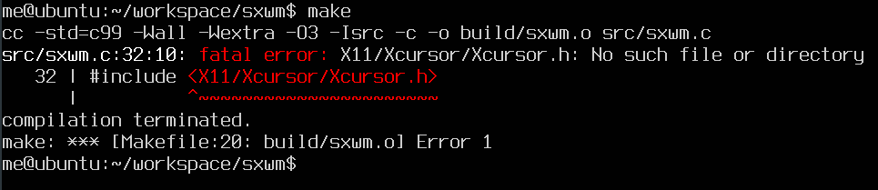
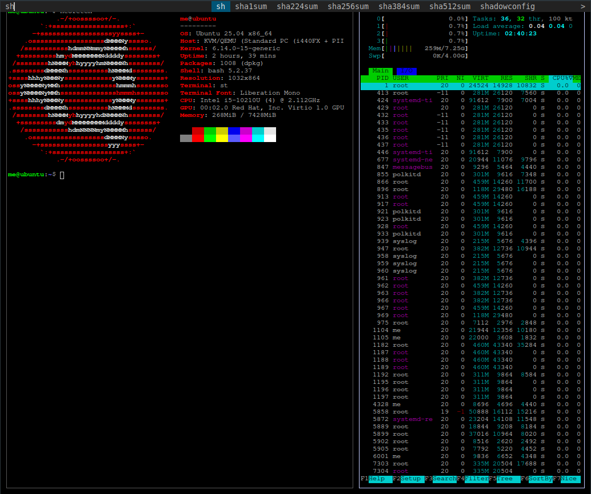
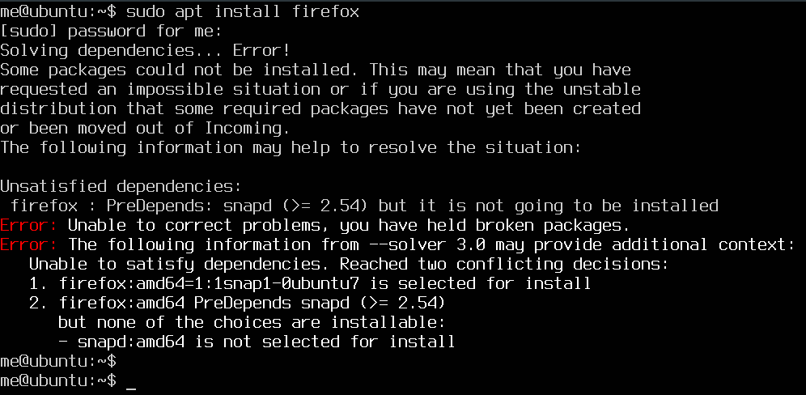
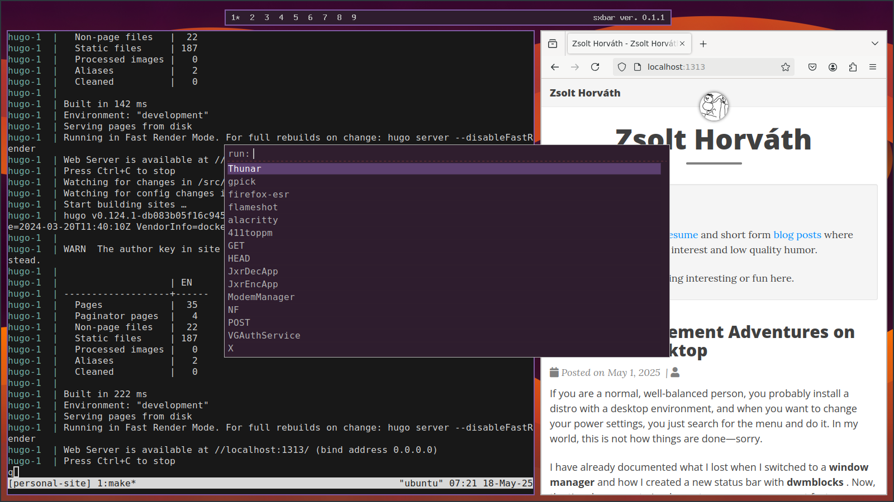

Instead of the usual rambling, I'll make a guide for something that I find really fun: setting up a graphical interface on an OS that does not have one. For this, I usually use **Debian** without a desktop environment. We'll check this out on an **Ubuntu Server** because the word "server" emphasizes that it should not have a GUI. But it will!

<!--more-->

**This guide was created for Ubuntu 25.04, and the tools we use are subject to change. The steps may change as time passes!**

## Preparing Ubuntu

If you expected that I would guide you through the installation, you will be disappointed. Download the server ISO, install it on a machine or a VM—I will use the latter. Finish the installation, and do not install any additional packages that could be handy for a server, we won't need them. Do an `update` and `upgrade`, and you should see something like this when you find out who and where you are:



Yes, my user is `me`, because me is me. Makes sense.

Without starting any religious war, we will remove `snap`. There are a couple of reasons: I don't like it, we don't need it, and I don't like it. I'm not against **universal package managers**, but for me, snap does not feel so snappy. If you like it, don't dismiss it.

Luckily, in **Ubuntu Server** this is very easy—it will bite back, but that is part of the fun. You can check how many snap packages you have with: `snap list`. If you did not install any extra packages, this should be zero, which is great, snap can be removed. We will remove it and hold it back:

```shell
sudo apt remove --purge snapd
sudo apt-mark hold snapd
```

No snappy snap snaps after this.



## Display Server

We will install **X11**, also known as the **X Window System**, which is a protocol and system that provides the basic framework for a graphical user interface for Unix-like operating systems. It is important to state that **Wayland** is another protocol, and most desktop environments are migrating to that. Both have their ups and downs, choosing **X11** is not a statement, it's just the dependency of the window manager we will use.

The easiest way to install it is to install **xinit**. Maybe you can guess what that is by the name, but from Wikipedia:

> The xinit program allows a user to manually start an Xorg display server. The startx script is a front-end for xinit.

This means we'll have a configurable entry point, a command called: `startx`

```shell
sudo apt install xinit
```

If you run `startx`, you will see a graphical terminal emulator called xterm. You can `exit` or `pkill xinit` if you're an animal.

## Window Manager

At this point, you could install **i3** with apt and add a line to `.xinitrc`:

```shell
exec i3
```

Without knowing the key bindings, you may have a "vim" experience exiting from it.

But we're going to do something much more interesting: building one ourselves, and it's not going to be **dwm**. Crazy!

We're going to use **sxwm**, a newborn—at the time when I'm writing this, it's 2 weeks old. The reason it caught my eye is its layout is very similar to **dwm**, but it has a very short and simple config file and it has hot reload. And it mostly does everything that I patched into **dwm**. Check out the [repository](https://github.com/uint23/sxwm), star it if you like it, it's really impressive.

Some general lessons about building software:

- Read the README

Thank you for your attention. But jokes aside, we're looking for the build dependencies and build steps, and we're lucky both are documented. It needs `libX11` and `Xinerama`, and a C compiler as well. Let's use `gcc`.

```shell
sudo apt install gcc libx11-dev libxinerama-dev
```

The build steps are `make` and `sudo make install`, it will first build and then copy the binary to `/usr/local/bin`. But something happens when we try to run `make`.



In these cases, you can surf through the _interwebz_ for answers, but I have a better solution. There is a tool called `apt-file` for cases like that. Run the following commands to find out what we're missing.

```shell
sudo apt install apt-file
sudo apt-file update
apt-file search X11/Xcursor/Xcursor.h
```

Now we see that the `libxcursor-dev` package needs to be installed. Do that. Run `make` and `sudo make install` so **sxwm** is built and installed.

Add the following line to `.xinitrc`:

```shell
exec sxwm
```

Run the command `startx`, and congratulations—you see a black screen. I will spare your time, you can exit with `Super+Shift+e`.

By default, this window manager has some bindings to suckless tools. We can install them just for trying it out.

```shell
sudo apt install suckless-tools stterm
```

To get a terminal, press `Super+Enter`, to show a runner, `Super+p`.



This picture is called _Two terminals one runner_.

## Ricing!

As much as I love **dmenu**, just to spice things up we're going to use **rofi**. Since it's available in Ubuntu repositories, go ahead and install it. Test it with the following command:

```shell
rofi -show run -theme purple
```

This theme will be our base. We will need to configure **sxwm**, but before that, let's install some more programs.

For the terminal, install **alacritty**, which is in the repositories. The only reason why we use it is that I really like it and it's widely available.

For the browser, let's install **Firefox** because that is not a [controversial browser in 2025](https://www.computerworld.com/article/3836787/strong-criticism-of-mozillas-new-firefox-user-agreement.html). Be so brave and run:

```shell
sudo apt install firefox
```

And if you did everything right, you should see:



I did say removing snap will bite back! Since we're holding it with `apt-mark` and it is a dependency for **Firefox**, we cannot install it. But we can use the **Mozilla PPA**.

```shell
sudo add-apt-repository ppa:mozillateam/ppa
sudo apt install firefox-esr
```

The configuration of **sxwm** will happen in the following file: `$HOME/.config/sxwmrc`. The default config can be found in the git repository, it's `default_sxrc`.

Let's change what applications are launched with the keybindings:

```shell
bind : mod + Return : "alacritty"
bind : mod + b : "firefox-esr"
bind : mod + p : "rofi -show run -theme purple"
```

And change colors to match **rofi**, and change border width:

```shell
border_width:            : 2

focused_border_colour    : #815ba4
unfocused_border_colour  : #b4b4b4
swap_border_colour       : #ef6155
```

Pressing `Super+r` will apply the changes in the current session—remember, _hot reload_.

Adding a wallpaper would be nice as well, so install `ubuntu-wallpapers` and `feh`. We will use it soon!

The last thing I want is a status bar. Luckily for us, the creator of **sxwm** created **sxbar**. Clone the [repository](https://github.com/uint23/sxbar) and run `make && sudo make install` in it.

If you want to change the appearance of the bar, you need to edit a header file `src/config.h`:

```c
#define BAR_COLOR_BG		"#2e1d2e"
#define BAR_COLOR_FG		"#b4b4b4"
#define BAR_COLOR_BORDER	"#815ba4"

#define BAR_FONT			"8x13bold"

#define BAR_WS_HIGHLIGHT_LEFT	""
#define BAR_WS_HIGHLIGHT_RIGHT	"*"
```

This will change the colors to again match **rofi** and change how highlight is visualized and the font as well. Rebuild it with: `sudo make clean install`.

For all our work to come alive, we need to edit the `.xinitrc` file:

```shell
feh --bg-fill /usr/share/backgrounds/Ubuntu_tide_by_lost-cause-light.png
sxbar&
sxwm
```

This will set the background, start **sxbar** in the **background**, and start **sxwm**.

## The Result

Let me present to you the fruit of our hard work!

In this image I'm running this site locally with Docker while inspecting logs and opening the runner:



If you made it to the end, let me congratulate you. I hope you enjoyed this _computering™_ adventure very much.

