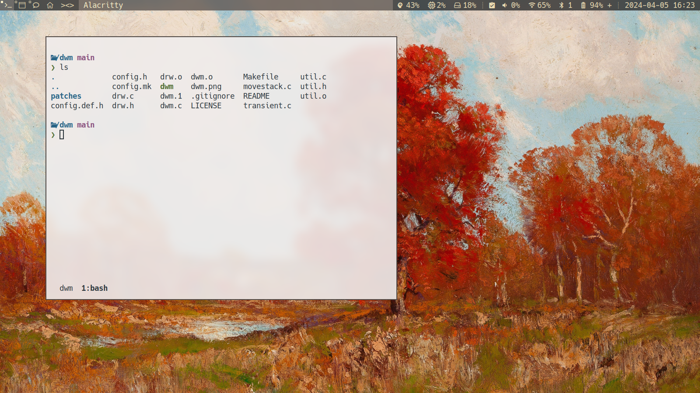

## Hard can be easier

I use Gnome with a POP Shell plugin for tiling functionality. That is a setup that I really like, I would even be alright with base Gnome if I had to. All that said, I wanted to try a tiling window manager, because it's not enough to use a computer, we have to **experience** it.

**i3** was my first choice, it scared me and I ran away. To be honest it would be a really good first choice, but it's late.

**AwesomeWM** was my second choice, but it has very long configuration and I have very short patience.

So I spent months on setting up **dwm**, of course _(The net time can be counted in days, but that is not enough drama!)_. Still, there is a benefit of forced slow progression, it makes easier to understand the steps.

**dwm** is not just another software, it's a **suckless** software. Which means it is "simple, minimal and usable", which are values that I value. And I have to confess, I really like the aesthetics of it.

There are some key differences between **dwm** and other tiling window managers.

- There is no configuration file, you have to edit the source code and recompile it. Well you could say the header file is _the_ configuration file, but you still have to recompile it.
- Since you have to compile it, there is no reason to install it with a package manager.
- You maintain your own version, catered to your own needs.

## Finding missing header files

For compiling this glamorous (not really) software you will need some header files, otherwise you will get errors like `fatal error: X11/Xlib.h: No such file or directory`.

You can find on the _interwebz_ which packages will contain the header files you need, but you can also find them by yourself.

I use Debian based distros (not sorry), so I can use the utility `apt-file` to find which package contains the header file I need.

```bash
$ apt-file search X11/Xlib.h
libx11-dev: /usr/include/X11/Xlib.h
```

Then it can be installed with the following command `sudo apt install libx11-dev`.

**dwm** has a `Makefile` so the build process is as simple as running `sudo make clean install`.

## Patching

I needed some more functionality like: window centering, per tag settings, autostarting programs and of course gaps.

These patches can be downloaded and applied with git. Or not. It's a good idea to have your own repository of **dwm**, but I made a monorepo for all my suckless software. In this case monorepo means I have a lot of directories in one repository and I don't use git submodules, you're welcome.

So the root directory of repository is not the same as the root directory of the **dwm** repo.

It is very fortunate that there is another utility called `patch` that can apply patches to source code. All patches collected in a dedicated directory, it can be called as:

```bash
patch < patches/dwm-cool-autostart-6.2.diff
```

## Things are not granted

When you have a build and start it, the first realization is that there some functionality that is missing, because you're not in a desktop environment anymore.

Sooo, there is no wallpaper, but there is screen tearing, there is no screen lock, there is no system tray (thank for God), there is no functioning function key combinations and the mousepad is working differently.

In other words by GPT the third,

> In yonder realm, no wallpaper is found,
>
> Yet screens doth tear, and truths abound.
>
> No lock to guard, no tray to hold,
>
> Function keys mute, mysteries untold.
>
> The mousepad, once familiar, now doth stray,
>
> In this curious world, it finds its own way.

These tribulations had to overcome by me, but since I own the source code, I can do whatever I want. And it's important to acknowledge that these problems would ail all tiling window managers.

And I sinned as well, I built the autostarting and all the key combination functionality into my **dwm**. This is a very bad idea if you want to separate concerns and reuse functionality in other window managers. But honestly I really like that it's bundled in one program.

## Conclusion

As you see these are the lessons, not the solutions. I hope they are helpful to you, but I can't guarantee that.

All I can show you...



---

P.S.: This whole thing was deprecated before birth. Thanks Wayland!
