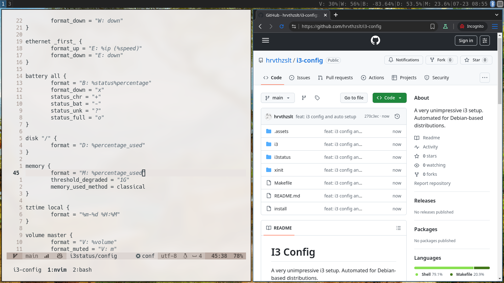

+++
date = '2025-07-27T11:00:23Z'
draft = false
title = 'Third Time the Charm With i3'
+++

I had three topics in mind that I could have worked out and presented here, but instead, I created an **i3** config to prove to myself that I still love **dwm**.

<!--more-->

The _improved improved improved window manager_ always bugged me, and I've tried to fall for it twice already. As I mentioned, I have one _true_ love among window managers, but I think now I finally understand **i3**.

There are some benefits to using **i3**: it's widely accessible, easy to configure, and has very good documentation. One important thing to understand is that although new windows take up the most space on the screen, this is still a manual tiler. Instead of having a set layout, you manage it on the fly. This is the most distinct feature of **i3**, and it's also the one I like the least. It's common practice to make **i3** an auto-tiler with scripts, but I did not want to go that route. I just want to use it as it's meant to be by design. And honestly, I can use any kind of tiling because usually, I have only one or two windows per workspace.

As you can guess, I did not change much visually—mostly kept the default colors and reduced the information on the **i3status** bar.

The most time-consuming part was setting up the keybindings because I already had a lot of expectations in that area. I use `sxhkd` with **dwm**, but I made my i3 config simpler, so I said goodbye to it.

My intention is for this to be my fast and dirty graphical environment when needed, so it is missing some features that I have in **dwm**. For example, there are no keybindings for a clipboard manager, which I don't use in **i3**.

Another driving force was that the only **Wayland** compositor that looks good to me and seems to be stable is **sway**. When I want to jump, it would be easier to switch to it if I already have a working **i3** config.

So, fifteen years late to the party, but here is my [config](https://github.com/hrvthzslt/i3-config).
