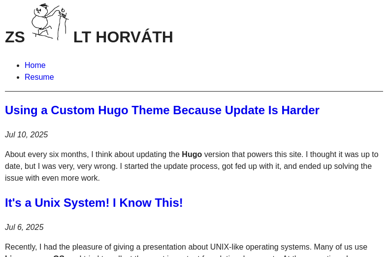

+++
date = '2025-07-10T14:28:56Z'
draft = false
title = 'Using a Custom Hugo Theme Because Update Is Harder'
+++

About every six months, I think about updating the **Hugo** version that powers this site. I thought it was up to date, but I was very, very wrong. I started the update process, got fed up with it, and ended up solving the issue with even more work.

<!--more-->

## Local Environment

Until now, I used a Docker image from Docker Hub to run **Hugo** locally. I would check if there was a new version and update it. Deployment is handled by **Netlify**, where I specify the **Hugo** version in a config file. Everything worked nicely.

But a couple of days ago, I realized that the latest tag of the Docker image was more than a year old. So I checked what the current **Hugo** version should be, and I was lagging behind.

## Let's Update

This should not have been a problem. I searched for a new Docker image with a new **Hugo** version, spun it up locally, and of course it did not work.

I was using a theme (a really nice one) that was made by someone else, and it lived in a git submodule ...don't worry, this is normal. I had also made some layout changes myself, but that should be fine, handling that is a feature of **Hugo**.

So I updated the submodule as well, but template rendering still failed. I fixed my custom layouts, since they were likely offenders, aaand it still didn't work. After having the best twenty minutes of my life swimming in GitHub issues, I said:


## Time for a Change

I decided I would get rid of these pesky dependencies. They will always break! They are the apocalyptic horsemen of modern software development!!! Why can't everything be **one binary** running on **DOS**!?

I had a lot of ideas about what to do:

- Create a static site by hand
- Write my own static site generator in **Go**
- Write my own static site generator and server in **shell**
- Try out **11ty**
- Create a new **Hugo** site with a custom theme

Fortunately (for my sanity, and sadly for my fun), I went with the last option. This was a good idea because I do like **Hugo**, and it was much easier than I anticipated.

```shell
hugo new site homepage
hugo new theme hometheme
```

And just like that, I had a functional site. I had to do some configuration on the page and theme, and migrate the content (which just meant copying files in this case), but that's all, one _dependency_ gone.

Now it would be nice to run it, so it was time to get rid of my other _dependency_ and create my own `Dockerfile`.

```Dockerfile
FROM debian:bookworm

RUN apt-get update && apt-get -y install wget

RUN wget -O /tmp/hugo.deb https://github.com/gohugoio/hugo/releases/download/v0.147.9/hugo_0.147.9_linux-amd64.deb \
    && apt install -y ./tmp/hugo.deb

WORKDIR /homepage

EXPOSE 1313

CMD ["hugo", "server", "--buildDrafts", "--buildFuture", "--bind", "0.0.0.0"]
```

You can judge me, but this is basically how you install **Hugo** according to the documentation. I added some commands in a **Makefile** for easier management, and that's it. Next time I need to update, I just have to change this image and the deployment configuration.

## Theme

I tried to make only a few small changes to the default theme. I adjusted the header and footer and added pagination, nothing too complicated. I expect that will make compatibility issues easier to resolve in the future.

But the default CSS styling looked like this:



Honestly, I don't think this is bad at all, but I have a soft spot for classless **CSS**, so I wanted to check out some ready-to-use ones. You might scream at me that it's another _dependency_, but in reality, it will be one file, frozen in time, never updated. The last time I did much **CSS** work, `flexbox` was a hot new thing, and I'm not going back...

There are three classless **CSS** "things" (I don't want to call them frameworks) that I really like, and it's not a trade secret: [Pico](https://picocss.com/), [Simple.css](https://simplecss.org/), and [Sakura](https://oxal.org/projects/sakura/).

The first one is really well-rounded, but I liked the second one more, and the third is the most elegant. So I used the second one with the colors of the third.

I hope you were able to follow.

