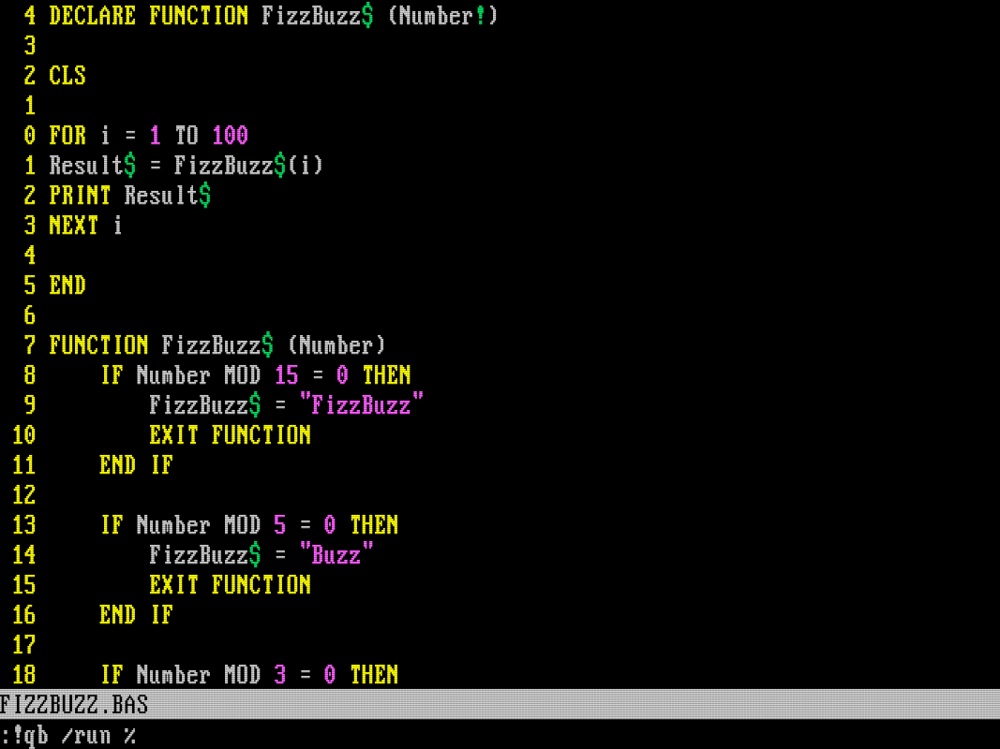
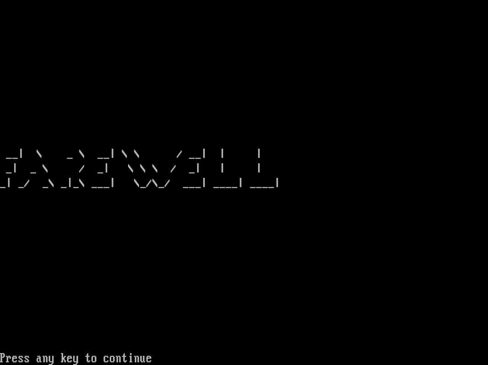

+++
date = '2025-08-24T10:23:04Z'
draft = false
title = 'Writing FizzBuzz in QBasic (in DOS) With Vim'
+++

This is the amalgamation of years of _computering™_: the pit of madness, the loss of reason. Next time they ask you to write FizzBuzz, you’ll know what to do.

<!--more-->

## Porting my Vim Setup to DOS

This tale started with a somewhat useless idea: I wanted to use part of my [minimalist CLI development environment](/posts/birth-of-a-minimalistic-cli-development-environment-i) in my [DOSBox setup](/posts/creating-my-dream-dos-setup). I already had **Vim** running in **DOSBox**, but there were some issues, like help files not being found.

As I wrote in the latter post, most of the software got into DOS by copying them, as it turned out, I had to copy some more stuff. I found a guide specifically about this [here](https://www.geeksforgeeks.org/installation-guide/how-to-install-and-use-vim-on-dosbox/), which is very, very strange, but helpful.

So **Vim** was fully functional. Now I needed to customize it not via `.vimrc`, but `_VIMRC`. I think at this point copying is a recurring theme, I copied my config, but of course it didn't work fully.

I had to say a tearful goodbye to `ctags`. I found a version that would run in 32-bit Windows, but it had no DOS mode, so no luck.

Another integral tool of that config is `grep`. Accidentally, I found a version of `grep` that is shipped with **Turbo C++**, but in the end I did not bother and just used the `vimgrep` command.


## Choosing a Programming Language

I had an editor, but only some batch files to edit, so I needed a programming language. The first language I learned was **Turbo Pascal**, and I wanted to try **Turbo C++** as well (so much Turbo). I managed to get both working, but landed on **QBasic 1.1**. The reason is that this is the version shipped with **MS-DOS 5.0**, so it had the most sentimental value. For a lot of people, that was their first programming language. Now I could relive that experience. It does not have a compiler like other versions, but I'll live.

I will return to **Turbo Pascal**, because I want to rebuild my first-ever program, but that is a story for another time.

All these languages come with their own IDE. They are really easy to use, with great built-in features like automatic formatting and step debugging.


I checked out **DJGPP** as well, which is a port of **GCC** to **DOS** and would be a great fit for **Vim**. I did not manage to get that working, but I may return to it as well.

## Workflow with Vim and QBasic

The text editing experience is still the best in **Vim**, so I wanted to write the code in it. The only thing I did was create keymaps in `_VIMRC` to run certain commands, with certain filetypes.

```vim
autocmd FileType basic nnoremap <buffer> <leader>r :!qb /run %<CR>
autocmd FileType vim nnoremap <buffer> <leader>r :source %<CR>
```

This means `basic` files can be run with `<leader>r`, and **Vim** scripts can be sourced with the same keymap. The command `qb /run %` immediately runs the current file in **QBasic**.

This is an implementation of the great _edit-compile-run_ cycle (without compilation, really), the only workflow you’ll need after the apocalypse.



## Writing FizzBuzz in QBasic

At this point, I realized I knew _basically_ nothing about **Basic** (pun intended), so let's write FizzBuzz, the most popular programming exercise of all time, which can be done by anyone's grandmother.

I’ll show you a method and try to collect the most amazing details:

```basic
FUNCTION FizzBuzz$ (Number)
    IF Number MOD 15 = 0 THEN
        FizzBuzz$ = "FizzBuzz"
        EXIT FUNCTION
    END IF

    IF Number MOD 5 = 0 THEN
        FizzBuzz$ = "Buzz"
        EXIT FUNCTION
    END IF

    IF Number MOD 3 = 0 THEN
        FizzBuzz$ = "Fizz"
        EXIT FUNCTION
    END IF

    FizzBuzz$ = STR$(Number)
END FUNCTION
```

- Lot of uppercase goodness
- Single equals sign for comparison
- Function and variable names can end with `$` to indicate they are strings
- Returning a value is done by assigning to the function name
- `EXIT FUNCTION` is used to return early
- `STR$` is used to convert a number to a string because there is no implicit conversion

All very logical, I like it.

The most problematic part of this solution is that with most input, most of the conditions will run, but they need to be evaluated anyway...

Then we need to loop through the numbers and print the result, so the main program is:

```basic
CLS

FOR i = 1 TO 100
Result$ = FizzBuzz$(i)
PRINT Result$
NEXT i

END
```

Thank you for following yet another adventurous tale. I hope you enjoyed it as much as I did. Prepare **DOSBox**, **QBasic**, and **Vim**, and join your next interview with confidence.


