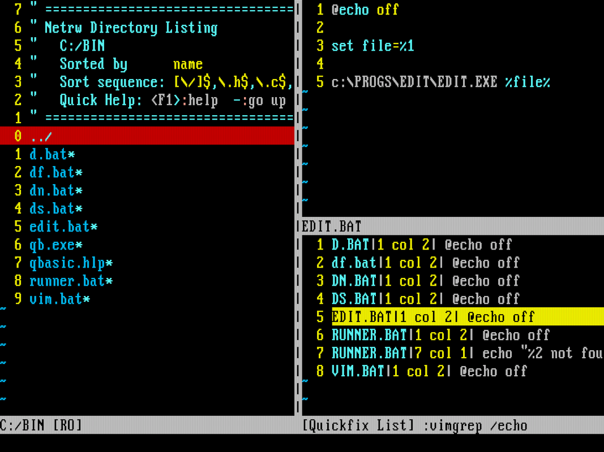

+++
date = '2025-08-24T10:23:04Z'
draft = false
title = 'Writing FizzBuzz in Quick Basic (in DOS) With Vim'
+++

This is the amalgamation of years of _computering™_, the pit of madness, the loss of reason. Next time they ask you to write FizzBuzz you know what to do.

<!--more-->

## Porting my Vim Setup to DOS

This tale started with a somewhat useless idea: I wanted to use part of my [minimalist cli development environment](/posts/birth-of-a-minimalistic-cli-development-environment-i) in my [DOSBox setup](/posts/creating-my-dream-dos-setup). I already had vim running in DOSBox, but there were some issues, like help files not being found.

As I wrote in the latter post, most of the software got into DOS by copying them, as it turned out, I had to copy some more stuff. I found a guide specifically about this [here](https://www.geeksforgeeks.org/installation-guide/how-to-install-and-use-vim-on-dosbox/) which is very very strange, but helpful.

So vim was fully functional, now I needed to customize it not via `.vimrc`, but `_VIMRC`. I think at this point copying is a reoccurring theme, I copied my config, but of course it didn't work fully.

I had to say a tearful goodbye to `ctags`, I found a version what would run in 32bit Windows, but that had no DOS mode, so no luck.

Another integral tool of that config is `grep`, accidentally I found a version of `grep` that is shipped with Turbo C++, but at the and I did not bother and just used the `vimgrep` command.



## Choosing a Programming Language

I had an editor, but only some batch files to edit, so I needed a programming language. The first language I learned was **Turbo Pascal**, and I wanted to try **Turbo C++** as well (so much Turbo), I managed to get both working, but landed on **Quick Basic 1.1**. The reason is that is the version that was shipped with **MS-DOS 5.0**, so it had the most sentimental value, for a lot of people that was their first programming language, now I could relive that experience. It does not have a compiler like other versions, but I'll live.

I will return to **Turbo Pascal**, because I want to rebuild my first ever program, but that is a story for another time.

All these languages are coming with their own IDE, they are really easy to use, with great built in features, like automatic formatting and step debugging.


I checked **DJGPP** as well, which is a port of **GCC** to **DOS**, which would be a great fit for Vim. I did not manage to get that working, but I may return to that as well.

## Workflow with Vim and Quick Basic

The text editing experience is still the best in Vim, so I wanted to write the code in Vim. The only thing that I did is created keymaps in `_VIMRC` to run certain commands, with certain filetypes.

```vim
autocmd FileType basic nnoremap <buffer> <leader>r :!qb /run %<CR>
autocmd FileType vim nnoremap <buffer> <leader>r :source %<CR>
```

This means `basic` files (Quick Basic) can be run with `<leader>r` (which is `\r` in my config), and vim scripts can be sourced with the same keymap. The command `qb /run %` immediately runs the current file in Quick Basic.

This is a great implementation of the _edit-compile-run_ cycle (without compile really), the only workflow that you will need after the apocalypse.


## Writing FizzBuzz in Quick Basic

At this point I realized I know basically nothing about Basic (pun intended), so let's write FizzBuzz, the most popular programming exercise of all time, which can be done by anyone.

I will show you a method and try to collect the most amazing details:

```basic
FUNCTION FizzBuzz$ (Number)
    IF Number MOD 15 = 0 THEN
        FizzBuzz$ = "FizzBuzz"
        EXIT FUNCTION
    END IF

    IF Number MOD 5 = 0 THEN
        FizzBuzz$ = "Buzz"
        EXIT FUNCTION
    END IF

    IF Number MOD 3 = 0 THEN
        FizzBuzz$ = "Fizz"
        EXIT FUNCTION
    END IF

    FizzBuzz$ = STR$(Number)
END FUNCTION
```

- Lot of uppercase goodness
- Single equals sign for comparison
- Function names and variable names can end with `$` to indicate they are strings
- Returning a value is done by assigning to the function name
- EXIT FUNCTION is used to return early
- STR$ is used to convert a number to a string, because there is no implicit conversion

All very logical, I like it.

The most problematic part of this solution is that with most of the input, most of the conditions will run, but they need to be evaluated anyway, so I will accept this inefficiency.

Then we need to loop through the numbers and print the result, so the main program is:

```basic
CLS

FOR i = 1 TO 100
Result$ = FizzBuzz$(i)
PRINT Result$
NEXT i

END
```

Thank you for following yet another adventurous tale of computers, I hope you enjoyed it as much as I did.


